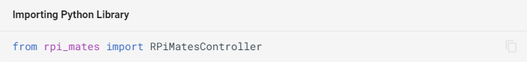
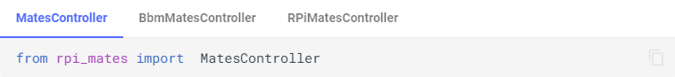

# Breadboard Mates Documentation Generator

This repository serves as a document generator for Breadboard Mates. It uses MkDocs which supports building into web and PDF documents. Both web and pdf documentation are automatically updated when changes are made to the repository assuming no error is found.

## Setting up in Windows

The following discusses how to setup a Windows machine to write and test documentation before deploying to the main branch.

It is recommended to use [Visual Studio Code](https://code.visualstudio.com/) or [VS Codium](https://github.com/VSCodium/vscodium/releases) for easy access to files, folders and command line interface.

Install latest Python from the [Microsoft Store](https://www.microsoft.com/en-us/search?q=python)

Install [GTK for Windows](https://github.com/tschoonj/GTK-for-Windows-Runtime-Environment-Installer/releases)

Clone the repository

    git clone https://github.com/BreadBoardMates/Breadboard-Mates-Resources.git

Create virtual environment

    python -m venv venv

Activate virtual environment

    venv\Scripts\activate

Install all requirements in virtual environment

    pip install -r requirements.txt

Try running/serving the mkdocs

    mkdocs serve

Open your browser and go to [localhost:8000 or 127.0.0.1:8000](http://localhost:8000)

## Writing Documentation

### Title

The title should be placed at the top of the Markdown document with a highest level of header

    # Example Title

### Headings

Headings are used to indicate chapter/section titles. The header level is indicated by the number of `#`

    ## Level 1

    This is a paragraph discussion about the Level 1 Header

    ### Level 2

    This is a paragraph discussion about the Level 2 Header

    ## Another Level 1

    This is a paragraph discussion about another Level 1 Header

    ### Another Level 2

    This is a paragraph discussion about another Level 2 Header

    #### Level 3

    This is a paragraph discussion about the Level 3 Header

    ### Another Level 2

    This is a paragraph discussion about the last Level 2 Header


### Paragraphs

A paragraph is anything that is not formatted as a whole but can contain various formatted text. Examples are available in [text formatting](#text-formatting) section

### Code Blocks

Writing example code is crucial for a good technical documentation. Therefore, a good way to show examples is absolutely necessary.

This section will only discuss the common examples. Detailed exaplanation of additional features can be found [here](https://squidfunk.github.io/mkdocs-material/reference/code-blocks/). 


#### Basic Block

Code blocks start and end with three backticks (`` ``` ``) as shown:

```` markdown
```
Code here
```
````

#### Specifying Language

It is ideal to specify the programming language used, this can be done by adding the applicable language specifier.

Example:

```` markdown
``` py
from rpi_mates import RPiMatesController
```
````

Output:

``` py
from rpi_mates import RPiMatesController
```

Useful specifiers are: `py`, `c`, `cpp`

#### Adding Titles

It is important a title for each code examples.

Example:

```` markdown
``` py title="Importing Python Library"
from rpi_mates import RPiMatesController
```
````

Output:



If the document already discusses what is being provided as example, a simple title like **Example** will do.


#### Multiple Examples

Sometimes, multiple slightly different examples need to be provided. In that case, [content tabs](https://squidfunk.github.io/mkdocs-material/reference/content-tabs/#grouping-code-blocks) can be used to group code blocks.

In this case, title should be placed as the tab title as shown.

Example:

```` markdown
=== "MatesController"

    ``` py
    from rpi_mates import  MatesController
    ```

=== "BbmMatesController"

    ``` py
    from bbm_mates import BbmMatesController as MatesController
    ```

=== "RPiMatesController"

    ``` py
    from rpi_mates import RPiMatesController as MatesController
    ```
````

Output:




### Text Formatting

All text except those inside code blocks can be formatted to **bold**, _italic_, **_bold italic_**, ~~strikethrough~~ and `code span`. This is use

| Style             | Example             | Common Usage                                                                     |
|:----------------- |:------------------- |:-------------------------------------------------------------------------------- |
| _italic_          | `_italic_`          | Provides emphasis. ex. variable type, enum type etc.                             |
| **bold**          | `**bold**`          | Provides higher emphasis.                                                        |
| **_bold italic_** | `**_bold italic_**` | Provides highest emphasis                                                        |
| ~~strikethrough~~ | `~~strikethrough~~` | Not commonly used                                                                |
| `code span`       | `` `code span` ``   | Programming related. ex. command, function, method, constant and variable names. |

The usage examples provided are not strictly in place except for code spans. Everything else can be used as necessary.

