---
tags:
  - Commander
  - Architect
  - Genius
  - Builder
---

# Mates Studio User Manual

## Introduction

Mates Studio is an Integrated Development Environment designed to be used with Breadboard Mates products. This software application is developed for Windows PCs.

The application includes multiple [environments](#environments) that users can utilize to design and develop simple and complex GUI applications for their prototyping needs.

## System Requirements

Mates Studio is currently available for 64-bit Windows PCs. Here are the requirements for installing the application:

- Windows 7 and later are supported, older operating systems are not supported (and do not work). Please note that the ARM version of Windows is not supported.
- An Intel Pentium 4 processor or later that’s SSE3 capable.
- At least 300 MB of storage space
- Minimum 1GB of RAM (_depends on usage_)

## Installation

Mates Studio can be installed for all users (system wide) or only for the current user.

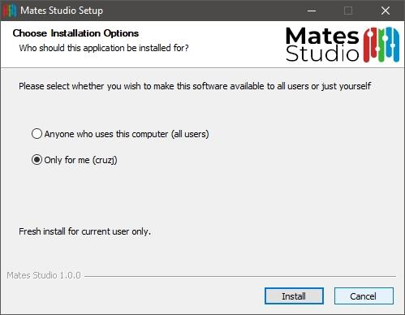{: class="custom-img-center" }

By choosing to install for all users, the install will prompt for administrator privileges.

{: class="custom-img-center" }

Once approved, the application will be installed in Program Files directory. The full path is typically:

    C:\Program Files\Mates Studio

If the application is installed only for the current user, the application will be in the current user’s AppData Local Programs directory. In that case, the full path is:

    C:\Users\%USERNAME%\AppData\Local\Programs\Mates Studio

The installer will provide a visual progress bar until the installation completes.

{: class="custom-img-center" }

After successfully installing Mates Studio, the installer will prompt to optionally launch the application.

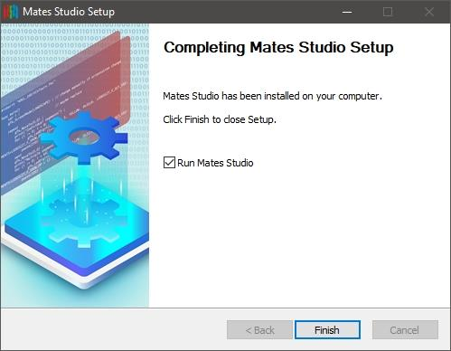{: class="custom-img-center" }

Tick _Run Mates Studio_ to launch Mates Studio after installation if desired.

## Creating a New Project

Selecting Product and Orientation

:   When the application opens, it will show the splash screen followed by the setup window.

:   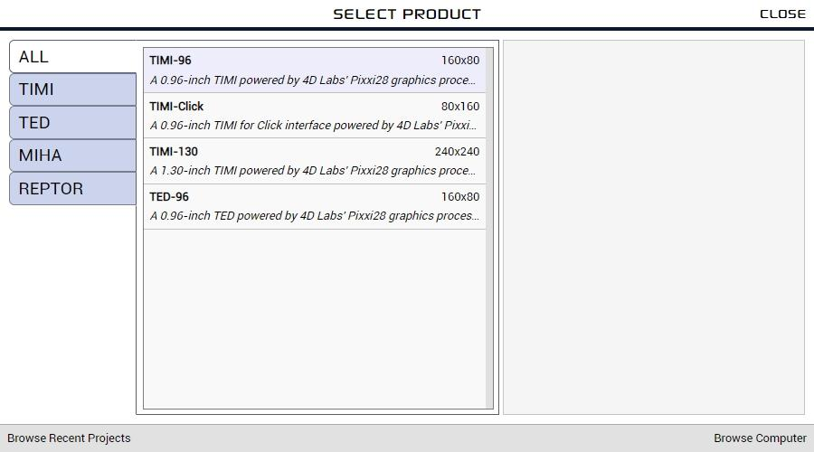{: class="custom-img-shadow" }

:   Products can be filtered by choosing the category tabs on the left-hand side. The center column provides a filtered selection of products. By selecting a product from the list shown in the center column of the window, a preview of the product will be shown on the right-hand side.

:   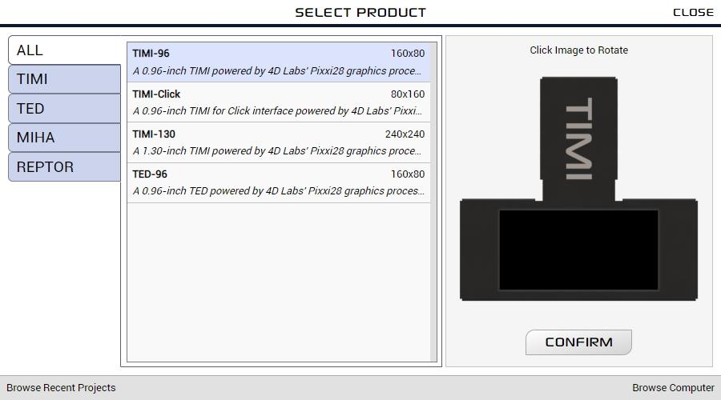{: class="custom-img-shadow" }

:   By clicking on the preview, the project orientation can be set.

:   {: class="custom-img-shadow" }

:   After selecting the product and desired orientation, continue by clicking on the **CONFIRM** button.

Selecting Environment

:   After confirming the product, the target environment needs to be selected to start a new project.

:   {: class="custom-img-shadow" }

## Opening Projects

Browsing Recent Projects

:   While in the setup window, recent projects can be browsed by clicking on the Browse Recent Projects button.

:   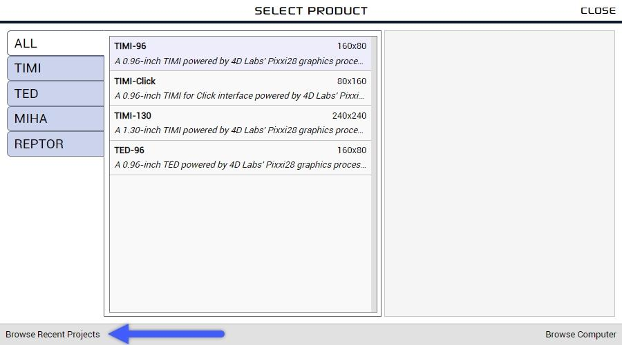{: class="custom-img-shadow" }

:   Recent projects can be filtered by choosing the category tabs on the left-hand side.

:   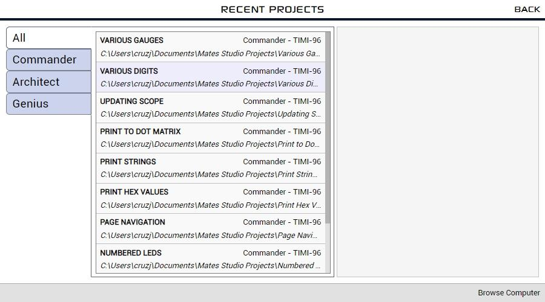{: class="custom-img-shadow" }

:   By selecting a project from the list shown in the middle column of the window, a preview of the project will be shown on the right-hand side.

:   {: class="custom-img-shadow" }

:   By clicking on the preview, the other project pages can be browsed.

:   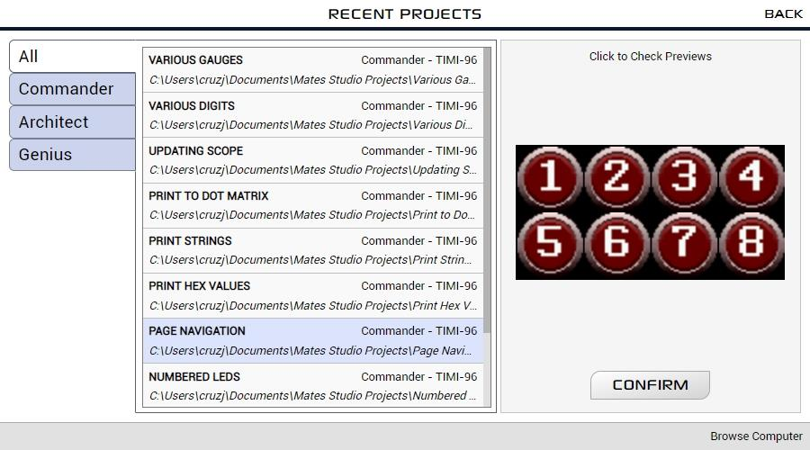{: class="custom-img-shadow" }

:   After confirming the project, it can be opened by clicking on the **CONFIRM** button.

Browsing the Computer

:   While in the setup window, the computer can be browsed for projects by clicking on the Browse Computer button.

:   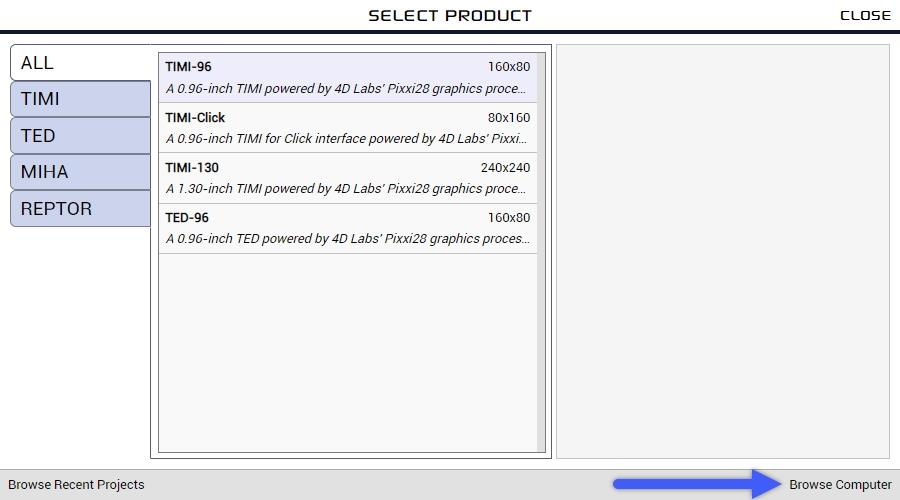{: class="custom-img-shadow" }

:   Mates Studio will open a file selection window which can be utilized to find and open a project anywhere in the computer.

:   

## Environments

### Commander

Commander is the simplest among all Mates Studio environments. It allows users to select and utilize different page designs/layouts from a built-in collection provided by the Breadboard Mates team and its community. This allows development of GUI applications in seconds.

This environment is designed to program Breadboard Mates modules to be used with a host controller using the [Mates Controller Command Protocol](mates-controller-command-protocol.md). This allows users to control the display using their favorite microcontrollers through Serial UART.

This environment also includes a [Mates Controller Interface](mates-controller-interface.md) that simulates a microcontroller controlling the display module programmed with a Commander project.

### Architect

Similar to Commander, the Architect environment was designed to program modules to be used with a host controller and features [Mates Controller Command Protocol](mates-controller-command-protocol.md). It also provides the [Mates Controller Interface](mates-controller-interface.md) to simulate a host controller.

The main advantage of Architect over Commander is the increased flexibility with designing their projects by featuring a [Graphics Editor](mates-studio-graphics-editor.md) which allows custom widget and page designs.

### Genius

The Genius environment is designed to allow user to write their own custom programs for Breadboard Mates module. This allows Breadboard Mates modules to work as standalone devices.

It features a [Graphics Editor](mates-studio-graphics-editor.md)  allowing custom widget and page designs and a [Code Editor](mates-studio-code-editor.md) to write the program in [4D Graphics Language (4DGL)](https://4dsystems.com.au/mwdownloads/download/link/id/17/). This provides direct control of the widgets and the unused device peripherals allowing custom functionalities that users need which Commander and Architect are not able to provide.

### Builder

Similar to Genius, the Builder environment is designed to allow user to develop custom programs for their Breadboard Mates modules.

It also features a [Graphics Editor](mates-studio-graphics-editor.md)  allowing custom widget and page designs. But instead of a code editor, it features a [Blocks Editor](mates-studio-blocks-editor.md). This also provides direct control of the widgets and the unused device peripherals allowing custom functionalities that users need which Commander and Architect are not able to provide.

This environment is designed mainly for inexperienced 4DGL developers but can also be used by seasoned developers. This environment can be used to develop varying complexity of projects. However, as the project becomes increasingly complicated, writing the code in Genius can prove to be more manageable for experience developers.

## Application Menus

Excluding Commander, all Mates Studio environments use a traditional dropdown menu bar. These three environments have almost identical menus. This section discusses the menu bar including which environment certain items apply.

### File Menu

The File Menu group includes items that can be used for file management. It includes the following:

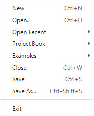{: class="custom-img-center" }

| Item         | Description                                                    |
|:------------ |:-------------------------------------------------------------- |
| New          | Opens the Setup Window to create new project                   |
| Open…        | Opens a window prompting to select a project file to open      |
| Open Recent  | Provides a list of recently opened projects                    |
| Project Book | Provides a list of projects found in the default save location |
| Examples     | Provides a list of examples included with Mates Studio         |
| Close        | Closes the current project                                     |
| Save         | Saves the project                                              |
| Save As…     | Saves the project to a different location and/or filename      |
| Exit         | Exits Mates Studio                                             |

### Graphics Menu

The Graphics Menu group includes items that can be used for managing the UI design. This includes page and widget management tools and options as shown:

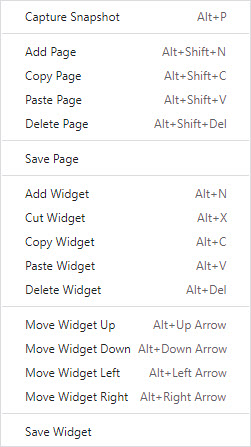{: class="custom-img-center" }

| Item             | Description                                                    |
|:---------------- |:-------------------------------------------------------------- |
| Capture Snapshot | Saves a snapshot of the selected page as an image file         |
| Add Page         | Opens a Select Page Template window                            |
| Copy Page        | Copies the selected page for pasting                           |
| Paste Page       | Pastes the recently copied page to the current project         |
| Delete Page      | Deletes the selected page                                      |
| Save Page        | Saves the active page as a configuration file                  |
| Add Widget       | Opens a Select Widget window                                   |
| Cut Widget       | Copies the selected widget for moving to another page          |
| Copy Widget      | Copies the selected widget for pasting                         |
| Paste Widget     | Pastes the recently copied widget                              |
| Delete Widget    | Deletes the selected widget                                    |
| Save Widget      | Saves the selected widget as a configuration file              |

 
### Project Menu

The Project Menu group includes items that can be used for managing the project itself. This includes project compilation, upload and project settings as shown:

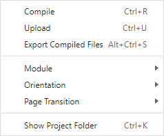{: class="custom-img-center" }

| Item                  | Description                                               |
|:--------------------- |:--------------------------------------------------------- |
| Compile               | Compiles the project to check for errors                  |
| Upload                | Compiles and upload the project if there are no errors    |
| Export Compiled Files | Compiles and exports project files if there are no errors |
| Module                | Provides option to change target module                   |
| Orientation           | Provides option to change module orientation              |
| Page Transition       | Provides option to select transitioning effect            |
| Baud Rate             | Provides option to set baud rate for communicating        |
| Show Project Folder   | Opens the location of the project                         |

### Edit Menu

The Edit Menu group includes items that can be used with the code/text editor of the Genius environment. This includes basic editing functionalities such as copying and pasting, undo and redo, etc.

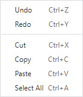{: class="custom-img-center" }

| Item          | Description                                                |
|:------------- |:---------------------------------------------------------- |
| Undo          | Cancel previous text editor action                         |
| Redo          | Redo previously cancelled text editor action               |
| Cut           | Copies the highlighted text for moving to another location |
| Copy          | Copies the highlighted text for pasting                    |
| Paste         | Adds previously copied text to the current cursor position |
| Select All    | Select all text available in the text editor               |
| Find          | Opens the search tool of the text editor                   |
| Find Next     | Moves to the next occurrence of the text                   |
| Find Previous | Moves to the previous occurrence of the text               |

!!! note

    This is only available in Genius Environment

### Tools Menu

The Tools Menu group includes helpful items that can be utilized during development.

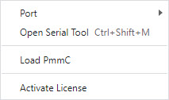{: class="custom-img-center" }

| Item             | Description                                                                  |
|:---------------- |:---------------------------------------------------------------------------- |
| Port             | Provides the option to scan and select COM port to use                       |
| Open Serial Tool | Opens Terminal tool for Genius and Builder or Mates Controller for Architect |
| Get Module Info  | Checks the module connected in the selected port                             |
| Load PmmC        | Opens the Load PmmC window for updating firmware                             |
| Activate License | Provides the option to activate full version of the environment              |

### Help Menu

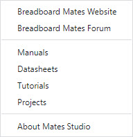{: class="custom-img-center" }

| Item                     | Description                                                                     |
|:------------------------ |:------------------------------------------------------------------------------- |
| Breadboard Mates Website | Opens Breadboard Mates Website using the default web browser                    |
| Breadboard Mates Forum   | Opens Breadboard Mates Forum using the default web browser                      |
| Manuals                  | Opens Breadboard Mates Resource Centre Manuals using the default web browser    |
| Datasheets               | Opens Breadboard Mates Resource Centre Datasheets using the default web browser |
| Tutorials                | Opens Breadboard Mates Resource Centre Tutorials using the default web browser  |
| Projects                 | Opens Breadboard Mates Resource Centre Projects using the default web browser   |
| About Mates Studio       | Shows the version information of Mates Studio                                    |

## Release Notes

??? abstract "Mates Studio Release Notes"

    **_1.0.14 : 5 May 2022_**

    - Fixed issue when opening projects by double clicking the file

    **_1.0.13 : 14 April 2022_**

    - Changed TIMI-Click to TIMI-MB

    **_1.0.12 : 5 April 2022_**

    - Fixed copy and paste issue in non-touch modules

    **_1.0.10 : 23 February 2022_**

    - Fixed issue with DotMatrix and TextArea not updating

    **_1.0.9 : 21 February 2022_**

    - Added 240x240 page designs
    - Added auto update feature
    - Increased UART receive buffer size for Commander and Architect projects

    **_1.0.8 : 15 January 2022_**

    - Added 240x240 page designs
    - Fixed display issues when image and page background image when there is no other inherent and GCI widget included

    **_1.0.7 : 05 January 2022_**

    - Added 240x240 page designs
    - Added swipe event logging system
    - Added new functions/commands:
        - *getSwipeEventCount*: counts the number of swipe events that hasn't been read
        - *getNextSwipeEvent*: reads the next swipe event, returns -1 if no event to read

    **_1.0.6 : 14 December 2021_**

    - Added support for REPTOR devices
    - Added automatic touch handling for input widgets
    - Added different modes for button widgets (toggle, momentary and navigation)
    - Added button event log system for momentary buttons
    - Added new functions/commands:
        - *getButtonEventCount*: counts the number of button events that hasn't been read
        - *getNextButtonEvent*: reads the next button event, returns -1 if no event to read
    - Implemented Query (getButtonEventCount, getNextButtonEvent) command in Control window/tab of Architect and Commander environments

    **_1.0.5 : 03 December 2021_**

    - Prevented input widgets from being used in non-touch modules
    - Changed MediaGaugeA to have the thumb option from MediaSlider
    - Fixed Commander documentation scroll issue
    - Fixed Page designs that uses sliders and knobs as gauges and buttons as LEDs
    - Fixed RotaryGauge behaving as an input widget
    - Fixed DLL missing from other Windows PCs

    **_1.0.4 : 17 November 2021_**

    - Fixed Inherent resource updates for gauges

    **_1.0.3 : 14 November 2021_**

    - Fixed MediaGaugeB compile and display error

    **_1.0.1 : 08 November 2021_**

    - Fixed Dot Matrix gradient issue caused by incorrect use of the widget's position
    - Fixed Media Gauge D incorrect range computation

    **_1.0.0 : 13 October 2021 (Initial Public Release)_**

    *Supported Products*

    - TIMI-96
    - TIMI-Click
    - TIMI-130
    - TED-96

    *Available Widgets*

    - Label
    - Scale
    - Panel
    - Media Panel
    - Symbol
    - Image
    - Led
    - Media Led
    - Media Color Led
    - Fancy Led A
    - Led Digits
    - Led Spectrum
    - Media Spectrum
    - Dot Matrix
    - Gauge A
    - Gauge B
    - Gauge C
    - Gauge D
    - Gauge E
    - Gauge F
    - Angular Meter
    - Ruler Gauge
    - Media Gauge A
    - Media Gauge B
    - Media Gauge C
    - Media Gauge D
    - Media Thermometer
    - Rotary Gauge
    - Slide Show
    - Animation
    - Symbols
    - Led Digits
    - Scope
    - Button A
    - Button B
    - Switch A
    - Switch B
    - Media Button
    - Fancy Button A
    - Slider A
    - Slider B
    - Slider C
    - Slider D
    - Slider E
    - Slider F
    - Media Slider
    - Knob
    - Media Rotary
    - Text Area
    - Print Area
