---
tags:
  - Commander
  - Architect
---

# Mates Controller Command Protocol

## Introduction

Mates Studio's Commander and Architect environments are designed to create user interfaces for Breadboard Mates' display products with the purpose of using these with the user's preferred host controller.

Architect and Commander projects utilizes the same simple Serial Command protocol allowing any host controller to communicate with the display modules. The protocol features commands including, but not limited to, updating, and reading widget value, changing backlight level, and changing widget color parameters.

### Boot Sequence

During boot of Architect and Commander projects, the display starts by performing its initial setup which includes mounting external storage devices, displaying initial page _Page0_ and initializing UART for receiving commands and transmitting replies.

After setting up everything required, the display sends a ACK `0x06` signifying that the display is ready to accept commands from the host controller.

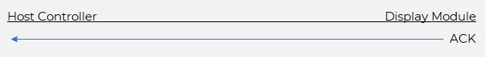{: class="custom-img-center custom-img-shadow" }

### Command Summary

The command protocol features a simple data exchange format between the host controller and the display module. All commands come from the host controller. After receiving a command from the host, the display performs the appropriate actions and replies to the host controller appropriately. The display's reply always starts with an ACK `0x06` followed by an appropriate response as required, or a NACK `0x15` if the command fails.

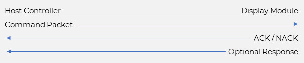{: class="custom-img-center custom-img-shadow" }

## Basic Commands

Commands for controlling the display's basic functionality are included and discussed in this section. These commands include activating a specific page, querying the active page, setting backlight level, and performing a soft reset.

### Set Page

Sets the active page shown by the project

| Parameters | Type           | Description                                        |
|:----------:|:--------------:|:-------------------------------------------------- |
| Command    | Command        | `0x0000`                                           |
| Index      | 16-bit Integer | Specifies the target page to activate              |

!!! info "Response"

    None

!!! example

    === "Success"

        Successfully set the active page to Page1 [0x0001]

        {: class="custom-img-center custom-img-shadow" }

    === "Failed"

        Failed attempt to set the active page to Page16 [0x0010]
        
        {: class="custom-img-center custom-img-shadow" }

      
### Get Page

Queries the active page

| Parameters | Type           | Description                                        |
|:----------:|:--------------:|:-------------------------------------------------- |
| Command    | Command        | `0x0001`                                           |

!!! info "Response"

    Active Page Index

!!! example

    Queried the active page and got Page5 [0x0005]

    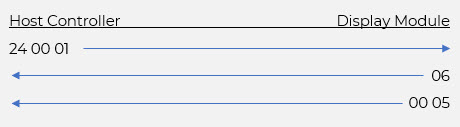{: class="custom-img-center custom-img-shadow" }

### Set Backlight

Sets the backlight level of the display module

| Parameters | Type           | Description                                        |
|:----------:|:--------------:|:-------------------------------------------------- |
| Command    | Command        | `0x0006`                                           |
| Level      | 16-bit Integer | Specifies the target backlight level [0 to 15]     |

!!! info "Response"

    None

!!! example

    Successfully set backlight level to 7 [0x0007]

    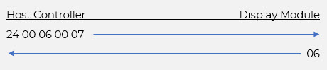{: class="custom-img-center custom-img-shadow" }

### System Reset

Performs a software reset

| Parameters | Type           | Description                                        |
|:----------:|:--------------:|:-------------------------------------------------- |
| Command    | Command        | `0x0009`                                           |

!!! info "Response"

    None

!!! example

    Performs a software reset and waits until the display is ready

    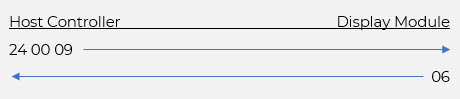{: class="custom-img-center custom-img-shadow" }

!!! note

    The ACK from the display module is the same acknowledgement received during a boot sequence. This signifies that the display is ready to receive and process commands.

## Common Widget Commands

Most of Mates Studio widgets hold a 16-bit integer value which can be set and queried by the host controller. Most widgets also include the feature to change and read certain color parameters during runtime. Commands related to these features are included and discussed in this section.

!!! note

    1. All applicable widget types are listed [here](./mates-studio-graphics-editor.md#mates-widgets-compatibility).
    2. This command is not applicable to _Int32_ and _Float_ LedDigits

### Set Widget Value

Update the target widget to the specified value

| Parameters | Type           | Description                                        |
|:----------:|:--------------:|:-------------------------------------------------- |
| Command    | Command        | `0x0002`                                           |
| Type       | 8-bit Integer  | Specifies the type of target widget                |
| Index      | 8-bit Integer  | Specifies the index of target widget               |
| Value      | 16-bit Integer | Specifies the new value                            |

!!! info "Response"

    None

!!! example

    Successfully turns ON [0x0001] Media Led [0x40] index 3 [0x03]

    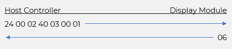{: class="custom-img-center custom-img-shadow" }

### Get Widget Value

Queries the value of the target widget

| Parameters | Type           | Description                                        |
|:----------:|:--------------:|:-------------------------------------------------- |
| Command    | Command        | `0x0003`                                           |
| Type       | 8-bit Integer  | Specifies the type of target widget                |
| Index      | 8-bit Integer  | Specifies the index of target widget               |

!!! info "Response"

    Value of the specified widget

!!! example

    Queried the value of Media Gauge B [0x47] index 5 [0x05] and got 75 [0x004B]

    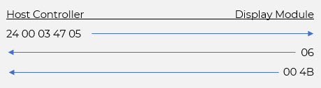{: class="custom-img-center custom-img-shadow" }

### Set Widget Parameter

Sets the specified widget's parameter to a new value

| Parameters | Type           | Description                                        |
|:----------:|:--------------:|:-------------------------------------------------- |
| Command    | Command        | `0x0004`                                           |
| Type       | 8-bit Integer  | Specifies the type of target widget                |
| Index      | 8-bit Integer  | Specifies the index of target widget               |
| Parameter  | 16-bit Integer | Specifies the target parameter                     |
| Value      | 16-bit Integer | Specifies the new value                            |

!!! info "Response"

    None

!!! example

    Successfully changes the Segment Color On [0x0008] parameter of Led Digits [0x05] index 7 [0x07] to RED [0xF800]

    {: class="custom-img-center custom-img-shadow" }

### Get Widget Parameter

Queries the parameter value of the target widget

| Parameters | Type           | Description                                        |
|:----------:|:--------------:|:-------------------------------------------------- |
| Command    | Command        | `0x0005`                                           |
| Type       | 8-bit Integer  | Specifies the type of target widget                |
| Index      | 8-bit Integer  | Specifies the index of target widget               |
| Parameter  | 16-bit Integer | Specifies the target parameter                     |

!!! info "Response"

    Value of the specified widget parameter

!!! example

    Queried the value of Ruler Gauge [0x01] index 10 [0x0A] Partition 1 Color [0x000C] and got GREEN [0x07E0]

    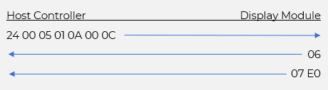{: class="custom-img-center custom-img-shadow" }

## Special Widget Commands

Some of Mates Studio widgets hold a 32-bit integer value or string, instead of a 16-bit integer value, which can be set by the host controller by utilizing special commands. Some widgets include unique features that adds more versatility to projects.

### Set 32-bit Widget Value

Update the target widget to the specified value

| Parameters | Type           | Description                                        |
|:----------:|:--------------:|:-------------------------------------------------- |
| Command    | Command        | `0xFFFC`                                           |
| Type       | 8-bit Integer  | Specifies the type of target widget                |
| Index      | 8-bit Integer  | Specifies the index of target widget               |
| Value      | 32-bit Value   | Specifies the new float or long value              |

!!! info "Response"

    None

!!! example

    === "32-bit Float"

        Sets the value of a Float-mode Led Digits [0x05] index 16 [0x10] to 3.1416 [0x40490FF9]

        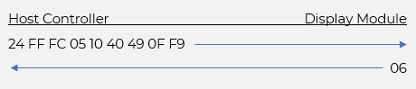{: class="custom-img-center custom-img-shadow" }

    === "32-bit Integer"

        Sets the value of a Int32-mode Led Digits [0x05] index 27 [0x1B] to 299792458 [0x11DE784A]

        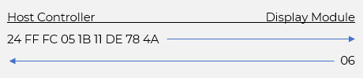{: class="custom-img-center custom-img-shadow" }

!!! note

    This command is only applicable to _Int32_ and _Float_ LedDigits

### Update Text Area

Update the Text Area with the specified string

| Parameters | Type           | Description                                        |
|:----------:|:--------------:|:-------------------------------------------------- |
| Command    | Command        | `0xFFFF`                                           |
| Index      | 16-bit Integer | Specifies the index of target Text Area            |
| Text       | ASCII          | Specifies the new (null terminated) string value   |

!!! info "Response"

    None

!!! example

    Sets the value of a Text Area index 2 [0x0002] to "Mates" [0x4D61746573]

    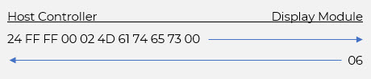{: class="custom-img-center custom-img-shadow" }

### Clear Print Area

Clear the specified Print Area

| Parameters | Type           | Description                                        |
|:----------:|:--------------:|:-------------------------------------------------- |
| Command    | Command        | `0x0007`                                           |
| Index      | 16-bit Integer | Specifies the index of target Print Area           |

!!! info "Response"

    None

!!! example

    Clears Print Area index 12 [0x000C]

    {: class="custom-img-center custom-img-shadow" }

### Set Print Area Color

Sets the color to use when appending to the specified Print Area

| Parameters | Type           | Description                                        |
|:----------:|:--------------:|:-------------------------------------------------- |
| Command    | Command        | `0x0008`                                           |
| Index      | 16-bit Integer | Specifies the index of target Print Area           |
| Color      | RGB565         | Specifies the new 16-bit color value               |

!!! info "Response"

    None

!!! example

    Sets the print color for Print Area index 17 [0x0011] to BLUE [0x001F]

    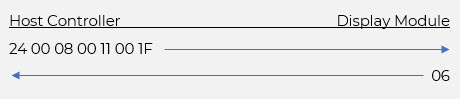{: class="custom-img-center custom-img-shadow" }

### Append to Print Area

Append an array of characters or bytes to the Print Area

| Parameters | Type           | Description                                        |
|:----------:|:--------------:|:-------------------------------------------------- |
| Command    | Command        | `0xFFFE`                                           |
| Index      | 16-bit Integer | Specifies the index of target Print Area           |
| Count      | 16-bit Integer | Specifies number of characters or bytes to write   |
| Data       | 8-bit Array    | Specifies the character or byte array to write     |

!!! info "Response"

    None

!!! example

    === "ASCII Mode"

        Append "Mates" [0x4D61746573] to an ASCII-mode Print Area index 8 [0x0008]

        {: class="custom-img-center custom-img-shadow" }

    === "Hex Mode"

        Append 00 AB CD EF 01 [0x00ABCDEF01] to an HEX-mode Print Area index 9 [0x0009]

        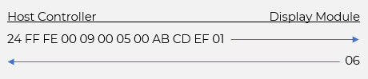{: class="custom-img-center custom-img-shadow" }

### Append to Scope

Append new set of values to the specified Scope widget

| Parameters | Type           | Description                                        |
|:----------:|:--------------:|:-------------------------------------------------- |
| Command    | Command        | `0xFFFB`                                           |
| Index      | 16-bit Integer | Specifies the index of target Scope                |
| Count      | 16-bit Integer | Specifies number of integers to write              |
| Data       | 16-bit Array   | Specifies the 16-bit data array to write           |

!!! info "Response"

    None

!!! example

    Append 40 [0x0028], 80 [0x0050], 120 [0x0078], 60 [0x003C] and 0 [0x0000] to Scope index 21 [0x0015]

    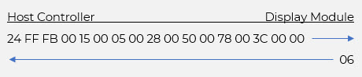{: class="custom-img-center custom-img-shadow" }

### Update Dot Matrix

Update the Dot Matrix with the specified string

| Parameters | Type            | Description                                        |
|:----------:|:---------------:|:-------------------------------------------------- |
| Command    | Command         | `0xFFFA`                                           |
| Index      | 16-bit Integer  | Specifies the index of target Dot Matrix           |
| Count      | 16-bit Integer  | Specifies number of characters to write            |
| Data       | Character Array | Specifies the character array to write             |

!!! info "Response"

    None

!!! example

    Update "Mates" [0x4D61746573] to Dot Matrix index 11 [0x000B]

    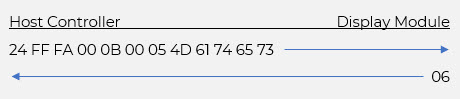{: class="custom-img-center custom-img-shadow" }

## Touch Input Commands

Commands for handling select touch events such as button presses, and simple swipe actions are included and discussed in this section.

### Get Number of Button Events

Queries the number of unread button events recorded by the module

| Parameters | Type           | Description                                        |
|:----------:|:--------------:|:-------------------------------------------------- |
| Command    | Command        | `0x000D`                                           |

!!! info "Response"

    Number of unread button events

!!! example

    Queried the number of button events and got 3 [0x0003]

    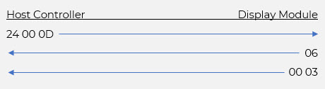{: class="custom-img-center custom-img-shadow" }

### Get Number of Swipe Events

Queries the number of unread swipe events recorded by the module

| Parameters | Type           | Description                                        |
|:----------:|:--------------:|:-------------------------------------------------- |
| Command    | Command        | `0x000F`                                           |

!!! info "Response"

    Number of unread swipe events

!!! example

    Queried the number of swipe events and got 2 [0x0002]

    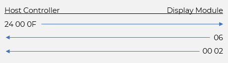{: class="custom-img-center custom-img-shadow" }

### Get Next Button Event

Queries the next unread button event

| Parameters | Type           | Description                                        |
|:----------:|:--------------:|:-------------------------------------------------- |
| Command    | Command        | `0x000E`                                           |

!!! info "Response"

    Button ID [High Byte: Type, Low Byte: Index]

!!! example

    Queried the next button event and got MediaButton5 [0x6205]

    {: class="custom-img-center custom-img-shadow" }

### Get Next Swipe Event

Queries the next unread swipe event

| Parameters | Type           | Description                                        |
|:----------:|:--------------:|:-------------------------------------------------- |
| Command    | Command        | `0x0010`                                           |

!!! info "Response"

    Swipe Information

!!! example

    Queried the next swipe event and got West [0x0004]

    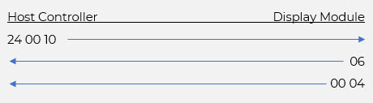{: class="custom-img-center custom-img-shadow" }

#### Swipe Value Reference

Swipe events can be detected as North, South, East and West.

| Direction | Value  |
|:---------:|:------:|
| North     | 0b0001 |
| South     | 0b0010 |
| East      | 0b0100 |
| West      | 0b1000 |

This command always returns both vertical and horizontal directions and therefore can be used to detect diagonal swipes.

The table below lists the suggested swipe flags that can be used for swipe handling.

| Event             | Value  | Condition                     |
|:----------------- |:------:|:----------------------------- |
| MATES_SWIPE_NORTH | 0b0001 | From bottom to top            |
| MATES_SWIPE_SOUTH | 0b0010 | From top to bottom            |
| MATES_SWIPE_EAST  | 0b0100 | From left to right            |
| MATES_SWIPE_WEST  | 0b1000 | From right to left            |
| MATES_SWIPE_VERT  | 0b0011 | only done vertically          |
| MATES_SWIPE_HORZ  | 0b1100 | only done horizontally        |
| MATES_SWIPE_TLBR  | 0b0110 | From top left to bottom right |
| MATES_SWIPE_TRBL  | 0b1010 | From top right to bottom left |
| MATES_SWIPE_BLTR  | 0b0101 | From bottom left to top right |
| MATES_SWIPE_BRTL  | 0b1001 | From bottom right to top left |

Here are the conditional statement examples for each of the suggested event flags

| Event             | Usage                                              |
|:----------------- | -------------------------------------------------- |
| MATES_SWIPE_NORTH | `(event & MATES_SWIPE_NORTH) == MATES_SWIPE_NORTH` |
| MATES_SWIPE_SOUTH | `(event & MATES_SWIPE_SOUTH) == MATES_SWIPE_SOUTH` |
| MATES_SWIPE_EAST  | `(event & MATES_SWIPE_EAST) == MATES_SWIPE_EAST`   |
| MATES_SWIPE_WEST  | `(event & MATES_SWIPE_WEST) == MATES_SWIPE_WEST`   |
| MATES_SWIPE_VERT  | `(event & MATES_SWIPE_VERT) != 0`                  |
| MATES_SWIPE_HORZ  | `(event & MATES_SWIPE_HORZ) != 0`                  |
| MATES_SWIPE_TLBR  | `(event & MATES_SWIPE_TLBR) == MATES_SWIPE_TLBR`   |
| MATES_SWIPE_TRBL  | `(event & MATES_SWIPE_TRBL) == MATES_SWIPE_TRBL`   |
| MATES_SWIPE_BLTR  | `(event & MATES_SWIPE_BLTR) == MATES_SWIPE_BLTR`   |
| MATES_SWIPE_BRTL  | `(event & MATES_SWIPE_BRTL) == MATES_SWIPE_BRTL`   |
