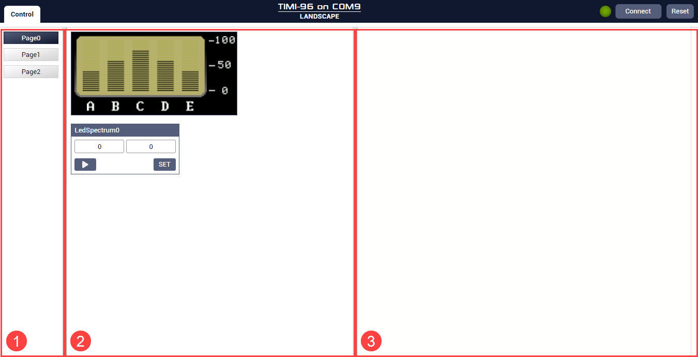

---
tags:
  - Commander
  - Architect
---

# Mates Controller Interface

## Introduction

Mates Studio's Commander and Architect Environment program the BBM modules with a simple [serial command protocol](mates-controller-command-protocol.md). This protocol can be followed by any chosen host microcontroller to control and interact with the module easily, as long as the host controller features UART interface.

For an added convenience, both Commander and Architect offers a simple controller interface that serves as a simulation tool for any host controller. This is useful when testing the capabilities and functionalities opened to the host controller before the actual deployment or host-side development. This manual discusses how to use the tool.

## Opening the Tool

- Commander Environment

    :   In a Commander project, the tool is accessible by simple clicking the **Control** tab.

- Architect Environment

    :   In an Architect project, the tool is accessible by simple clicking the **Mates Controller** button. This will open a separate window.

## User Interface

The Mates Controller tool can be divided into three separate columns.

1. Page Navigation

    :   This provides a simple way to change between the pages present in the project

2. Main Control Area

    :   This area displays all widgets that can be interacted with

3. Command Viewer Area

    :   This shows all the commands sent by during the simulation

### Page Navigation

### Main Control Area

### Command Viewer Area