---
tags:
  - Builder
---

# Mates Studio Blocks Editor

## Introduction

Mates Studio's Builder environment features a graphical programming interface, Blocks Editor, allowing both beginners and seasoned developers to control the flow of their application by simply visually connecting blocks.

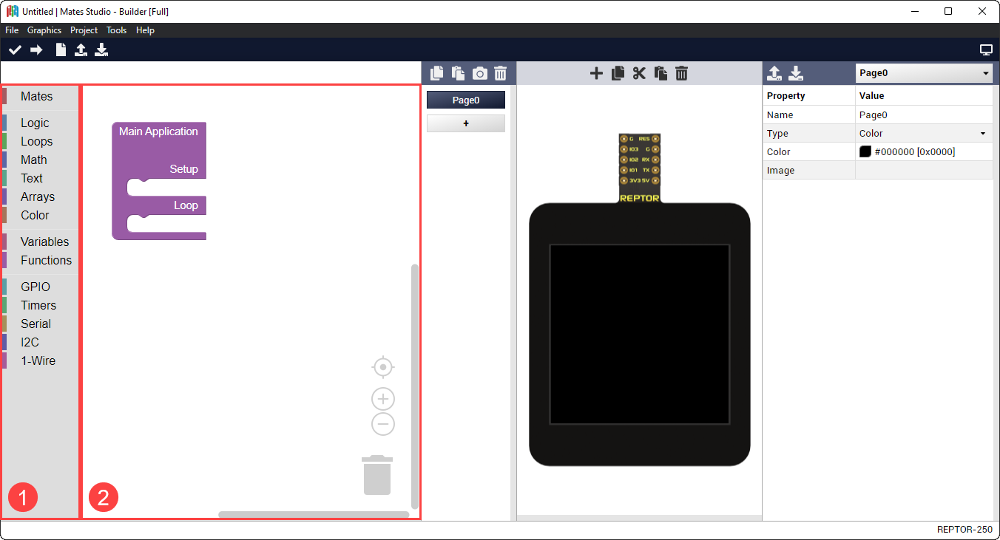

The image shows a newly started Builder project. Boxed are the parts of the Block Editor, the toolbox and the workspace.

1. **Toolbox**: This contains the available blocks that can be added to the workspace. Blocks are grouped into several categories to easily search for the desired features.
2. **Workspace**: As the name suggests, this is the main work area during development. This allows you to design the application's workflow.

Blocks are the fundamental elements of the Builder environment. These can be connected to each other in the workspace using their input and output connectors. 

### Block Input Types

Input connectors can either be value or statement input. These connectors are present in the right side of each block or internally in the case of value inputs. A block can have multiple input connectors.

Value Input Connector

:   
:   This connector accepts a single value block

Statement Input Connector

:   
:   This connector accepts multiple statement blocks

Blocks can also include internal inputs. Internal inputs provides fixed rules or items for the block. These can either be an integer input, a text input, a color input or a dropdown input.

Integer Input

:   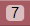
:   A simple number input which automatically corrects the value to the nearest integer which falls under a preset allowable range

Text Input

:   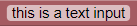
:   A simple text input allowing to specify names or text value for the block

Color Input

:   
:   A color input that provides a simple preset color selector

Dropdown Input

:   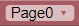
:   A dropdown selector which provided acceptable values that the block accepts
   

### Block Output Types

Output connectors are always present in either the left side, top side or top and bottom side of the block. These connectors can either be a value output or a statement output. A block can only have either a value or statement outputs, but not both types.

Value Output Connector

:   
:   This connector can connect to blocks with a value input connector

Statement Output Top and Bottom Connector

:   
:   This connector can connect to statement blocks with a top connector effectively joining the group of statement blocks. With the bottom connector, it allows more statement blocks to join the group.

Statement Output Top Connector

:   
:   This connector can connect to statement blocks with the bottom connector effectively joining the group of statement blocks. Having no bottom connector, it is not possible to connect another block below this signifying the end of actions performed by the group.

### Blocks Classification

These blocks can be classified depending on their [output type](#block-output-types).

In terms of output, blocks can be classified as a function block, a value block or a statement block.

Function Block

:   These are blocks with no output connector. This type of blocks helps organize the workspace by simplifying repeated multi-block actions.

Value Block

:   These blocks provides a left output connector. This type of blocks provides a value to a parent block that will be used to perform the desired action.

Statement Block

:   These blocks provides the top connector and, optionally, the bottom output. This type if blocks can be connected together to group actions to be performed by a parent block with a statement input connector.

## Mates Blocks

The Mates category includes blocks that directly interact and control the screen. This include backlight, page, widget and touch related blocks.

### Main Application

:   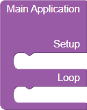
:   All Builder project starts with the main application block. It provides two statement inputs named setup and loop.
:   | Input     | Type      | Description                                      |
    |:---------:|:---------:|:------------------------------------------------ |
    | setup     | statement | allows developers to perform tasks at the beginning of the program which is during boot or immediately after a reset |
    | loop      | statement | allows developers to perform tasks indefinitely after performing the necessary setup |

### Graphics Blocks

This group contains blocks used for backlight, page and widget control and query.

#### Set Backlight Level

:   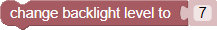
:   This block sets the backlight level of the display module.
:   | Input | Type      | Description                                      |
    |:-----:|:---------:|:------------------------------------------------ |
    | level | value     | intensity of backlight, must be between 0 and 15 |
:   !!! example 
        === "Set Backlight to Integer Value"

            {: class="custom-img-center" }

        === "Set Backlight to Variable Value"

            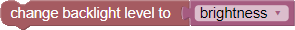{: class="custom-img-center" }

#### Set Page

:   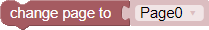
:   This block changes the project to the selected page. The page dropdown input lists all pages included in the project.
:   | Input | Type      | Description                                      |
    |:-----:|:---------:|:------------------------------------------------ |
    | page  | value     | target page to change into                       |
:   !!! example 
        === "Set Page to Existing Page"

            {: class="custom-img-center" }

        === "Set Page to Variable Value"

            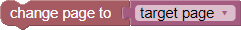{: class="custom-img-center" }

#### Get Page Index

:   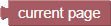
:   This block can be used to query the current page of the running project.
:   !!! info "Return"

        Selected page

#### Get Current Page

:   
:   This block can be used to query the current page of the running project.
:   !!! info "Return"

        Active page

:   !!! example "Example: Evaluate Page"

        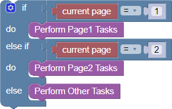{: class="custom-img-center" }

#### Get Number of Pages

:   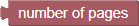
:   This block can be used to check the number of pages included in the project.
:   !!! info "Return"

        Number of pages in project

:   !!! example "Example: Increment Page and Loop to Page0"

        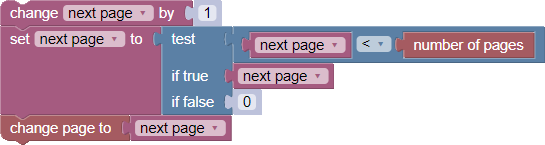{: class="custom-img-center" }

#### Set Widget Value

:   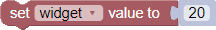
:   This block changes the value of the selected widget. The widget dropdown input lists all applicable widgets.
:   | Input  | Type      | Description                                      |
    |:------:|:---------:|:------------------------------------------------ |
    | widget | dropdown  | the target widget                                |
    | value  | value     | the value the target widget will be set to       |
:   !!! example 
        === "Set Gauge to Integer Value"

            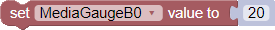{: class="custom-img-center" }

        === "Set Gauge to Variable Value"

            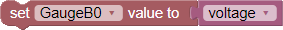{: class="custom-img-center" }

        === "Set Gauge to Slider Value"

            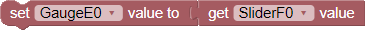{: class="custom-img-center" }

            !!! note

                It is recommended to simply link values of widgets by setting their properties as discussed [here](mates-studio-graphics-editor.md#linking-widgets).

#### Get Widget Value

:   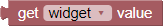
:   This block queries the value of the selected widget. The widget dropdown input lists all applicable widgets.
:   | Input  | Type      | Description                                      |
    |:------:|:---------:|:------------------------------------------------ |
    | widget | dropdown  | the target widget                                |
:   !!! info "Return"

        Value of the target widget

:   !!! example 
        === "Store Slider Value"

            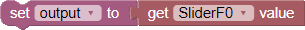{: class="custom-img-center" }

        === "Set Gauge to Slider Value"

            {: class="custom-img-center" }

            !!! note

                It is recommended to simply link values of widgets by setting their properties as discussed [here](mates-studio-graphics-editor.md#linking-widgets).

#### Set Spectrum Column Value

:   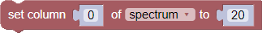
:   This block changes the value of the selected column of the target spectrum. The spectrum dropdown input lists all Spectrum widgets in the project.
:   | Input    | Type      | Description                                      |
    |:--------:|:---------:|:------------------------------------------------ |
    | column   | value     | the target column index, must be less than number of columns of the target spectrum |
    | Spectrum | dropdown  | the target Spectrum widget                       |
    | value    | value     | the value the target column will be set to       |

#### Update TextArea

:   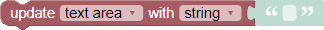
:   This block updates the target TextArea. The TextArea dropdown input lists all TextArea widgets in the project.
:   | Input    | Type      | Description                                      |
    |:--------:|:---------:|:------------------------------------------------ |
    | TextArea | dropdown  | the target TextArea widget                       |
    | format   | dropdown  | the formatting to use when writing the value     |
    | value    | value     | the value to update the DotMatrix with           |

#### Update DotMatrix

:   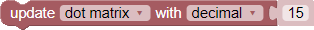
:   This block updates the target DotMatrix. The DotMatrix dropdown input lists all DotMatrix widgets in the project.
:   | Input     | Type      | Description                                      |
    |:---------:|:---------:|:------------------------------------------------ |
    | DotMatrix | dropdown  | the target DotMatrix widget                      |
    | format    | dropdown  | the formatting to use when writing the value     |
    | value     | value     | the value to update the DotMatrix with           |

#### Clear PrintArea

:   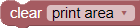
:   This block clears the target PrintArea. The PrintArea dropdown input lists all PrintArea widgets in the project.
:   | Input     | Type      | Description                                      |
    |:---------:|:---------:|:------------------------------------------------ |
    | PrintArea | dropdown  | the target PrintArea widget                      |

#### Set PrintArea Color

:   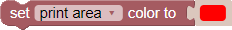
:   This block sets a new color for the target PrintArea to use. The PrintArea dropdown input lists all PrintArea widgets in the project.
:   | Input     | Type      | Description                                      |
    |:---------:|:---------:|:------------------------------------------------ |
    | PrintArea | dropdown  | the target PrintArea widget                      |
    | color     | value     | the new color value to use when appending to the target PrintArea |

#### Append to PrintArea

:   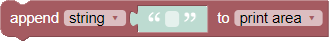
:   This block appends the specified value to the target PrintArea. The PrintArea dropdown input lists all ASCII type PrintArea widgets in the project.
:   | Input     | Type      | Description                                      |
    |:---------:|:---------:|:------------------------------------------------ |
    | format    | dropdown  | the formatting to use when writing the value     |
    | value     | value     | the value to update the PrintArea with           |
    | PrintArea | dropdown  | the target PrintArea widget                      |

#### Append Bytes to PrintArea

:   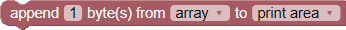
:   This block appends the specified array to the target PrintArea. The PrintArea dropdown input lists all HEX type PrintArea widgets in the project while the array dropdown lists all variables in the project.
:   | Input     | Type      | Description                                      |
    |:---------:|:---------:|:------------------------------------------------ |
    | count     | integer   | the number of bytes to write from the array      |
    | array     | dropdown  | a variable with an array of values to update the PrintArea with |
    | PrintArea | dropdown  | the target PrintArea widget                      |
:   !!! note

        1. A variable _array_ is automatically created if it doesn't exist.
        2. Ensure that the variable selected is initialized as an array using the [Create Array](#create-array) block.

#### Append Values to Scope

:   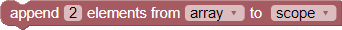
:   This block appends the specified array to the target Scope. The Scope dropdown input lists all Scope widgets in the project while the array dropdown lists all variables in the project.
:   | Input     | Type      | Description                                      |
    |:---------:|:---------:|:------------------------------------------------ |
    | count     | integer   | the number of values to write from the array     |
    | array     | dropdown  | a variable with an array of values to update the Scope with |
    | Scope     | dropdown  | the target Scope widget                          |
:   !!! note

        1. A variable _array_ is automatically created if it doesn't exist.
        2. Ensure that the variable selected is initialized as an array using the [Create Array](#create-array) block.

### Touch Input Blocks

Touch input blocks are only available for BBM modules with a touchscreen interface.

#### Get Event Button ID

:   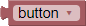
:   This block provides a selection of all buttons recording an event. This is useful when evaluating the recorded button events. The button dropdown input lists all Momentary and Grouped button widgets in the project.
:   | Input     | Type      | Description                                      |
    |:---------:|:---------:|:------------------------------------------------ |
    | button    | dropdown  | the momentary or grouped button                  |
:   !!! info "Return"

        ID of the selected button

#### Get Number of Recorded Button Events

:   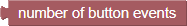
:   This block can be used to query the number of unread recorded button events.
:   !!! info "Return"

        Number of unread button events

#### Get Next Button Event

:   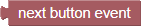
:   This block can be used to read/query the source of the next recorded button event.
:   !!! info "Return"

        ID of the source button

#### Get Number of Recorded Swipe Events

:   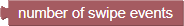
:   This block can be used to query the number of unread recorded swipe events.
:   !!! info "Return"

        Number of unread swipe events

#### Get Next Swipe Event

:   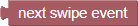
:   This block can be used to read the value of the next recorded swipe event.
:   !!! info "Return"

        Value of the swipe event

:   !!! note

        This value needs to be stored in a [variable](#variables) and evaluated using [Evaluate Horizontal Swipe](#evaluate-horizontal-swipe) or [Evaluate Vertical Swipe](#evaluate-vertical-swipe) blocks.

## Utility Blocks

This group provides useful blocks for designing program flow (conditions, loops, etc.), basic computation and value assignments.

### Logic Blocks

#### Logical Comparison

:   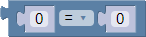
:   This allows developers to create comparisons which is typically used as test conditions that can be evaluated by other blocks.
:   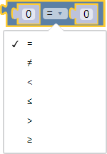
:   Available comparisons are as shown.
:   | Input     | Type      | Description                                      |
    |:---------:|:---------:|:------------------------------------------------ |
    | a         | value     | left side value for the comparison               |
    | operator  | dropdown  | equality operators for testing the two values    |
    | b         | value     | right side value for the comparison              |
:   !!! info "Return"

        Result of the comparison, true or false

:   !!! example 
        === "Evaluate Value of Variable"

            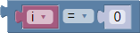{: class="custom-img-center" }

        === "Compare Two Variables"

            {: class="custom-img-center" }

        === "Store Result"

            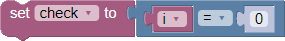{: class="custom-img-center" }

#### Logical Operations

:   
:   This allows developers to combine multiple [Logical Comparisons](#logical-comparison). This can be nested as multiple Logical Operation blocks. This is also typically used as test conditions that can be evaluated by other blocks.
:   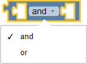
:   Available operations are as shown.
:   | Input     | Type      | Description                                      |
    |:---------:|:---------:|:------------------------------------------------ |
    | a         | value     | left side value for the operation                |
    | operator  | dropdown  | logical operators for joining the two values     |
    | b         | value     | right side value for the operation               |
:   !!! info "Return"

        Result of the operation, true or false

:   !!! example
        === "Check if Both are True"

            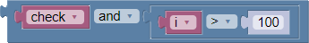{: class="custom-img-center" }

        === "Check if Any is True"

            {: class="custom-img-center" }

        === "Store Result"

            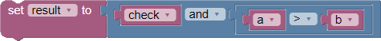{: class="custom-img-center" }

#### Logical Negate

:   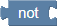
:   This allows developers to invert the output of [Logical Comparisons](#logical-comparison) and [Logical Operations](#logical-operations) and is also typically used as test conditions that can be evaluated by other blocks.
:   | Input     | Type      | Description                                      |
    |:---------:|:---------:|:------------------------------------------------ |
    | condition | value     | the condition to evaluate and negate             |
:   !!! info "Return"

        Negated value of the test condition

:   !!! example
        === "Negate Variable"

            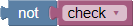{: class="custom-img-center" }

        === "Negate Logical Comparison"

            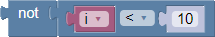{: class="custom-img-center" }

        === "Store Result"

            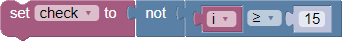{: class="custom-img-center" }

#### Logical Ternary Operation

:   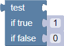
:   This allows developers to evaluate the output of [Logical Comparisons](#logical-comparison) and [Logical Operations](#logical-operations) and return a value depending on the truthfulness of the test condition.
:   | Input     | Type      | Description                                      |
    |:---------:|:---------:|:------------------------------------------------ |
    | test      | value     | the condition to evaluate                        |
    | true      | value     | the return value if condition is true            |
    | false     | value     | the return value if condition is false           |
:   !!! info "Return"

        The evaluated return value

:   !!! example
        === "Test Variable"

            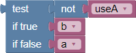{: class="custom-img-center" }

        === "Test Logical Comparison"

            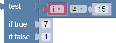{: class="custom-img-center" }

        === "Store Result"

            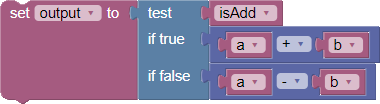{: class="custom-img-center" }

#### Conditional If-Else

:   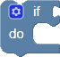
:   This allows developers to evaluate test conditions that will be evaluated to select which group of tasks to perform. Test conditions are usually created using the [Logical Comparison](#logical-comparison) block.
:   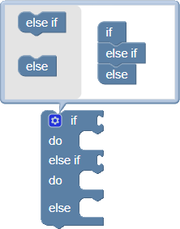
:   The block can be configured to add multiple test conditions (_else if_) and a default (_else_) condition which is triggered when none of the specified test conditions are met.
:   | Input     | Type      | Description                                      |
    |:---------:|:---------:|:------------------------------------------------ |
    | condition | value     | condition to evaluate before performing tasks    |
    | do        | statement | all the tasks to perform if condition is true    |
:   !!! note

        Number of _condition_ and _do_ inputs increases depending on configuration
    

#### Evaluate Horizontal Swipe

:   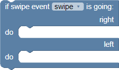
:   This block evaluates the selected variable for the horizontal direction of swipe. The variable must be previously set to the [Get Next Swipe Event](#get-next-swipe-event) block. Developers can use this to perform different tasks depending on whether the screen is swiped going left or right.
:   | Input     | Type      | Description                                      |
    |:---------:|:---------:|:------------------------------------------------ |
    | variable  | dropdown  | the variable to evaluate for the swipe direction |
    | right     | statement | all the tasks to perform if the swipe event is from left to right |
    | left      | statement | all the  tasks to perform if the swipe event is from right to left |
:   !!! note

        1. This block is only available for BBM modules with a touchscreen interface.
        2. A variable _swipe_ is created automatically if it doesn't exist.

#### Evaluate Vertical Swipe

:   
:   This block evaluates the selected variable for the horizontal direction of swipe. The variable must be previously set to the [Get Next Swipe Event](#get-next-swipe-event) block. Developers can use this to perform different tasks depending on whether the screen is swiped going up or down.
:   | Input     | Type      | Description                                      |
    |:---------:|:---------:|:------------------------------------------------ |
    | variable  | dropdown  | the variable to evaluate for the swipe direction |
    | up        | statement | all the tasks to perform if the swipe event is upwards |
    | down      | statement | all the  tasks to perform if the swipe event is downwards |
:   !!! note

        1. This block is only available for BBM modules with a touchscreen interface.
        2. A variable _swipe_ is created automatically if it doesn't exist.
        

### Loops Blocks

#### Repeat Count

:   

#### Repeat While or Until

:   
:   
:   

#### Count with Variable

:   
:   !!! note

        A variable _i_ is created automatically if it doesn't exist.

#### Break or Continue

:   
:   

### Math Blocks

### Text Blocks

### Arrays Blocks

#### Create Array

### Color Blocks

## System Blocks

This group provides useful blocks allowing developers to utilize additional hardware features available for the BBM module.

### GPIO Blocks

### Timers Blocks

### Serial Blocks

### I2C Blocks

### 1-Wire Blocks

## Dynamic Blocks

Dynamic blocks can be created multiple times. These can be used to further expand and provide more freedom in project development.

### Variables

Variables are key components in text programming. The builder environment allows creation of global variables. Once a variable is created, setter, getter and change blocks are generated.

A setter block allows the variable to be set while a getter block queries the value of the variable. A variable change block can be used to increase or decrease the value of the variable.

All of these blocks provides a dropdown selector listing the available variables. From the dropdown selector, several actions can be performed including selection, renaming and deletion of the variables.

A variable can be created by going to the Variables category and clicking the Create variable button.

This will open a prompt requesting a new variable name.

Alternatively, some blocks generate variables it requires. Create Function blocks generate their inputs as new variables if these don't exist. Other blocks that behave this way are blocks with variable dropdown which defaults to a specific variable name, in case the variable doesn't exist yet.

#### Set Variable

:   
:   This blocks allows developers to set the value of the selected variable.
:   | Input     | Type      | Description                                      |
    |:---------:|:---------:|:------------------------------------------------ |
    | variable  | dropdown  | the target variable to set                       |
    | value     | value     | the value to set the variable to                 |

#### Get Variable

:   
:   This blocks allows developers to query the current value of the selected variable.
:   | Input     | Type      | Description                                      |
    |:---------:|:---------:|:------------------------------------------------ |
    | variable  | dropdown  | the target variable to query                     |
:   !!! info "Return"

        Value of the variable

#### Change Variable by Value

:   
:   This blocks allows developers to change the value of the selected variable by the value specified.
:   | Input     | Type      | Description                                      |
    |:---------:|:---------:|:------------------------------------------------ |
    | variable  | dropdown  | the target variable to change                    |
    | value     | value     | the value to change the variable by              |

### Functions

Functions are another useful feature from text-based programming. Like in text programming, the builder environment provided block functions allowing developers to simplify repeated actions by grouping the blocks together and allowing these group of actions to be called and performed using a single block.

#### Create Function without Return Input

:   
:   This allows developers to group blocks to perform every time the function is called.
:   
:   Functions can be configured to take one or more value inputs by clicking the gear icon of the block to edit the configuration. The configure function inputs are also added as global variables.
:   | Input     | Type      | Description                                      |
    |:---------:|:---------:|:------------------------------------------------ |
    | name      | text      | unique name to identify the function             |
    | actions   | statement | all the actions to be performed by the function when called |

#### Create Function with Return Input

:   
:   This allows developers to group blocks to perform every time the function is called. It also provides a return value input. This is useful when performing reads or computations.
:   
:   Functions can be configured to take one or more value inputs by clicking the gear icon of the block to edit the configuration. The configure function inputs are also added as global variables.
:   | Input     | Type      | Description                                      |
    |:---------:|:---------:|:------------------------------------------------ |
    | name      | text      | unique name to identify the function             |
    | actions   | statement | all the tasks to be performed by the function when called |
    | return    | value     | the output value of the function after executing all tasks |

#### Function Return

:   
:   This block can be used to exit a function if a certain condition is met. Depending on the type of function, with or without return input, this block will automatically transform as required
:   
:   If used in a function with no return input, this block transforms to suitable block as shown. Notice that the value input is removed.
:   
:   If used in a function with a return input, this block reverts to its original state. Notice that the value input is added.
:   | Input     | Type      | Description                                      |
    |:---------:|:---------:|:------------------------------------------------ |
    | condition | value     | the condition to check for evaluating returns    |
    | return    | value     | the output value of the function (if applicable) |

#### Call Function

:   
:   This block calls the function of the same name. This is available after a [function with no return input](#create-function-without-return-input) is created.
:   
:   This may have one or more value inputs depending on the configuration of the function.

#### Call Function and Return Value

:   
:   This block calls the function of the same name and returns the output value. This is available after a [function with return input](#create-function-without-return-input) is created.
:   
:   This may have one or more value inputs depending on the configuration of the function.
:   !!! info "Return"

        Output of the function

