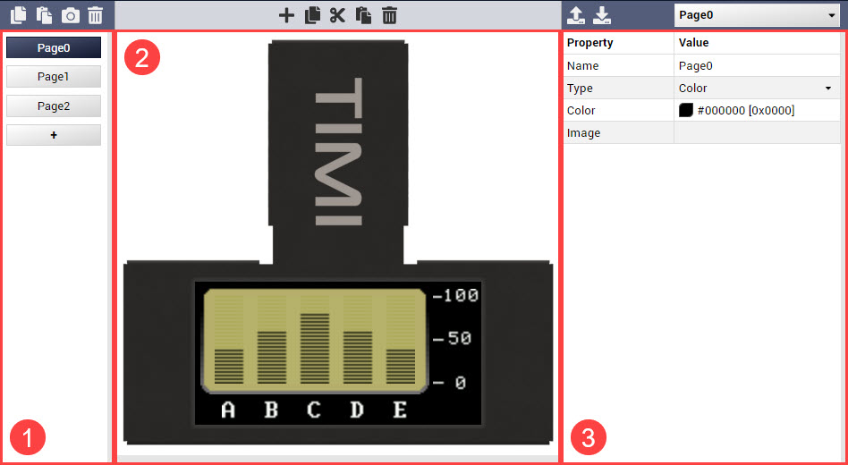

---
tags:
  - Architect
  - Genius
  - Builder
---

# Mates Studio Graphics Editor

## Introduction

Mates Studio provides a graphics editor for its Architect, Genius and Builder environments. This provides the ability to create custom page designs using various widgets supported by the BBM display modules. The interface is composed a graphics toolbar and three main editor tools.

1. [Page Selection](#page-selection)

    :   Provides a simple interface to add pages and select a page for editing.

2. [Visual Editor](#visual-editor)

    :   Provides a drag-n-drop interface for selecting and positioning widgets.

3. [Property Editor](#property-editor)

    :   Provides an editable property table for editing page and widget parameters

## Graphics Toolbar

The graphics toolbar provides buttons and dropdown menus for managing pages and widgets.

From left to right, the toolbar items are described in the table below:

| Item               | Description                                                                                 |
|:------------------ |:------------------------------------------------------------------------------------------- |
| Copy Page          | Copies the selected page for pasting                                                        |
| Paste Page         | Pastes the recently copied page to the current project                                      |
| Capture Page       | Saves a snapshot of the selected page as an image file                                      |
| Delete Page        | Deletes the selected page                                                                   |
| Add Widget         | Opens a Select Widget window                                                                |
| Copy Widget        | Copies the selected widget for pasting                                                      |
| Cut Widget         | Copies the selected widget for moving to another page                                       |
| Paste Widget       | Pastes the recently copied widget                                                           |
| Delete Widget      | Deletes the selected widget                                                                 |
| Load Configuration | Loads a widget or page configuration file                                                   |
| Save Configuration | Saves the selected a widget or page as a configuration file                                 |
| Paste Code         | Pastes a code snippet for the widget/page in the current cursor position in the text editor |
| Page/Widget Select | Lists the page and the widgets in the selected page for selection                           |

## Page Selection

### Adding a Blank Page

### Adding a Page from Template

## Visual Editor

### Add from Selection

### Add from Template

## Property Editor

## Graphics Editor Widgets

## Mates Widgets Compatibility

The table below lists the available widgets that applies to setWidgetValue, getWidgetValue, setWidgetParam and getWidgetParam functions.

| Widget                   | Value  |
|:------------------------ |:------:|
| MATES_LED                | 0      |
| MATES_RULER_GAUGE        | 1      |
| MATES_ANGULAR_METER      | 2      |
| MATES_GAUGE_A            | 3      |
| MATES_GAUGE_B            | 4      |
| MATES_LED_DIGITS         | 5      |
| MATES_LABELS             | 6      |
| MATES_BUTTON_A           | 32     |
| MATES_SWITCH_A           | 33     |
| MATES_SLIDER_B           | 34     |
| MATES_KNOB               | 35     |
| MATES_MEDIA_LED          | 64     |
| MATES_MEDIA_COLOR_LED    | 65     |
| MATES_GAUGE_C            | 66     |
| MATES_GAUGE_D            | 67     |
| MATES_GAUGE_E            | 68     |
| MATES_GAUGE_F            | 69     |
| MATES_MEDIA_GAUGE_A      | 70     |
| MATES_MEDIA_GAUGE_B      | 71     |
| MATES_MEDIA_GAUGE_C      | 72     |
| MATES_MEDIA_GAUGE_D      | 73     |
| MATES_MEDIA_THERMOMETER  | 74     |
| MATES_LED_SPECTRUM       | 75     |
| MATES_MEDIA_SPECTRUM     | 76     |
| MATES_SCOPE              | 77     |
| MATES_SYMBOLS            | 78     |
| MATES_ROTARY_GAUGE       | 79     |
| MATES_BUTTON_B           | 96     |
| MATES_SWITCH_B           | 97     |
| MATES_MEDIA_BUTTON       | 98     |
| MATES_SLIDER_A           | 99     |
| MATES_SLIDER_C           | 100    |
| MATES_SLIDER_D           | 101    |
| MATES_SLIDER_E           | 102    |
| MATES_SLIDER_F           | 103    |
| MATES_MEDIA_SLIDER       | 104    |
| MATES_MEDIA_ROTARY       | 105    |
| MATES_SLIDE_SHOW         | 128    |
| MATES_ANIMATION          | 129    |
| MATES_FANCY_LED_A        | 130    |
| MATES_FANCY_LED_B        | 131    |
| MATES_FANCY_BUTTON_A     | 160    |
| MATES_FANCY_BUTTON_B     | 161    |

**Note:** _Some widgets available in Mates Studio behaves differently than majority of the widgets. Such widgets doesn't apply for the common  set and get widget value and parameter functions._