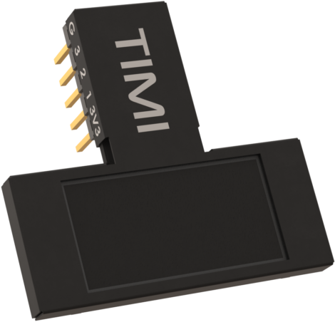
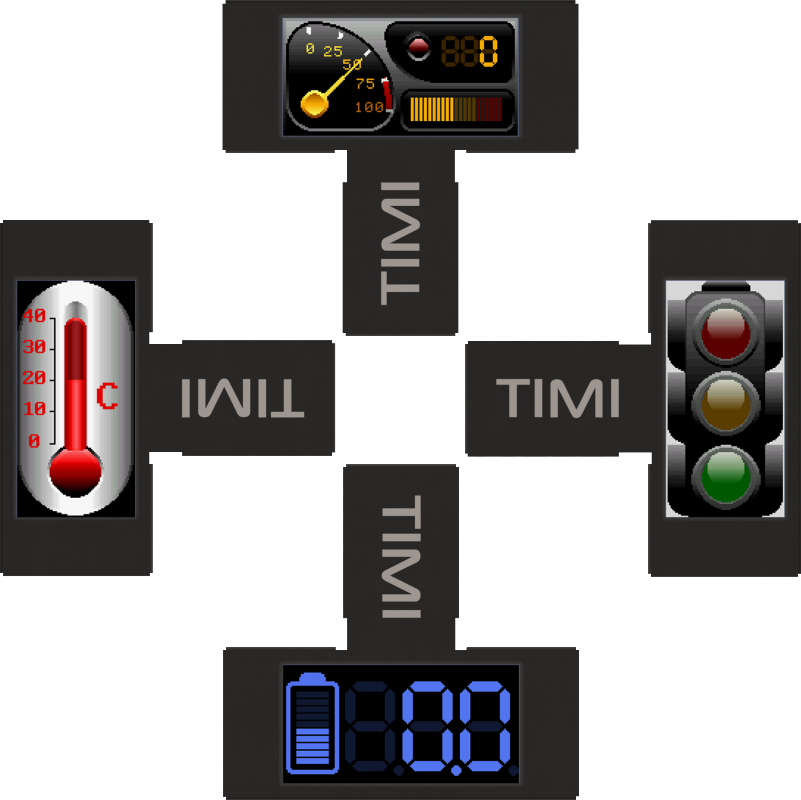
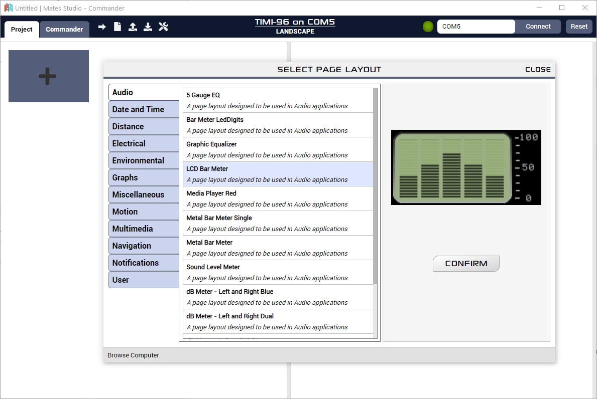
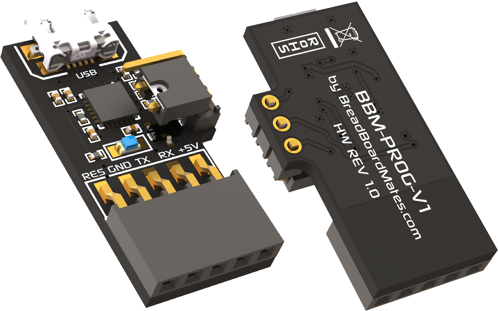
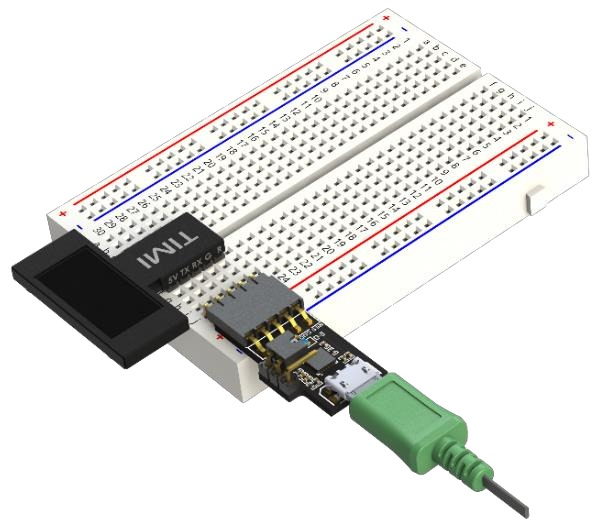
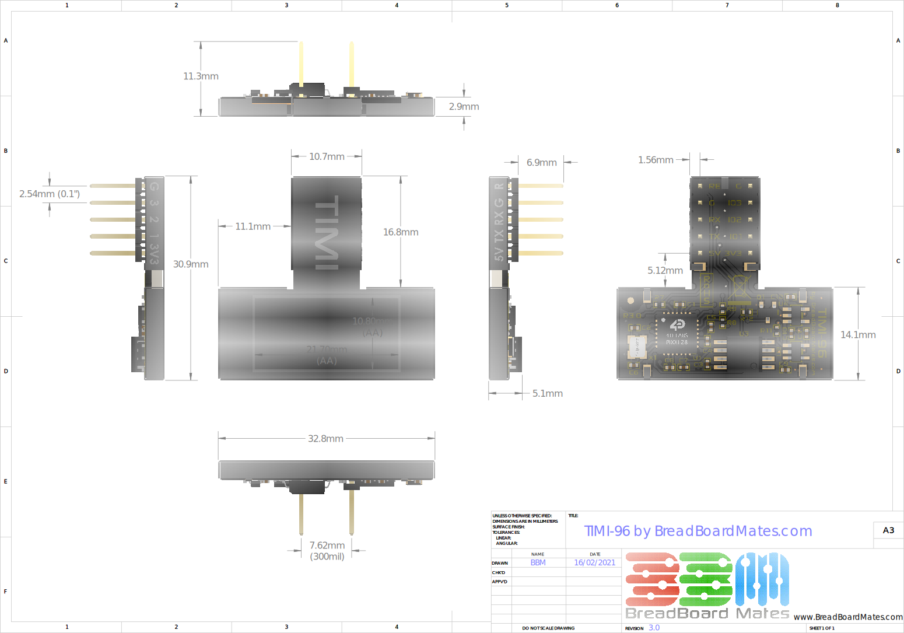

---
tags:
  - TIMI
  - TIMI-96
---

# Datasheet: TIMI-96

## Introduction

{: align=right width="33%" }

TIMI-96 (ref. TIMI) is a unique breadboard compatible display development module, aimed to speed up and reinvent the way electronic testing, development and projects are carried out, in either stand alone, host interfaced, PC tethered, or educational settings.

TIMI is a 0.96” TFT LCD display module that is driven directly by a PIXXI-28 graphics processor from 4D Labs. It features a unique MatesBus interface, which is simple to use in both breadboard applications, as well as on adaptors or directly into developed products.

TIMI was created as a flexible design aid, primarily to simulate components readouts and meters, which would otherwise be cumbersome or demanding on hardware resources for breadboard or electronic development. Simulating component readouts allows accelerated development and retains the often-limited GPIO hardware associated with many developments.

TIMI was designed for engineers, hobbyists, and students, from beginner to advanced levels, designed to make breadboarding or project development, easier.

## Product Features

TIMI’s main interface is a 3.3V level Asynchronous Serial UART and features 3 GPIO which can be used as Digital or Analog inputs, Digital Outputs, Master I2C Communication or PWM Audio output. These interfaces arm TIMI with resources to be either a stand-alone controller, a Host driven slave, or a tethered test instrument, while being capable of interfacing and powering external devices itself.

- Powered by 4D Labs Pixxi-28 Graphics Processor
- 160(W)x80(H) resolution TFT LCD, non-touch
- 3.3V (5V tolerant) Serial UART interface, capable 300 to 2187500 Baud
- Master I2C (3.3V level) interface bus
- 3 GPIO (3.3V level), 2 capable of Analog or I2C, 1 capable of PWM Audio
- 16MB of External SPI Flash Memory
- 32KB of Processor Flash Memory
- 14KB of Processor SRAM for User Variables
- Single supply 5V power input (*3.3V possible – See ‘System Pins’ Section)
- Dedicated 3.3V 500mA power output for User
- Standard 0.1” (2.54mm) pitch male pin headers, breadboard compatible
- RoHS and REACH compliant
- PCB is UL 94V-0 Flammability Rated
- Weight approx. 5.0 grams

## Hardware Detail

TIMI-96 utilizes the BBM MatesBus, which is a unique interface pinout designed to be simple and easy to use.

The MatesBus is made up of 2 rows of 5 pins, 0.1” (2.54mm) pitch, spaced 0.3” (7.62mm) apart, ideal for direct plug into a breadboard, or compatible adaptor or development board.

{: class="custom-img-center" width="80%" }

While the TIMI-96 can be orientated in any of its 4 positions, Portrait, Landscape, Portrait Reversed and Landscape Reversed, its natural position forms an upside-down ‘T’ shape and is designed to interface with the bottom of a breadboard, sitting closest to the User, leaving the top part of the breadboard free for components and wiring.

## Pin Configuration

The TIMI-96 MatesBus has 10 physical pins, 5 on each side of the interface neck, and are spaced apart to easy connect onto a breadboard.

The H2 Header doubles as a programming interface and features Power and Serial UART, while the H1 Header features Power Output and 3 GPIO (General Purpose IO).

!!! abstract "User I/O – Dual 5 way headers (H1 + H2)"

    | Header/Pin  | Symbol  | I/O Type | Description                                              |
    |:-----------:|:-------:|:--------:|:-------------------------------------------------------- |
    | Header1–1   | GND     | Power    | Module / System GND                                      |
    | Header1–2   | IO3     | I/O      | GPIO capable of Digital, PWM Audio Out (3.3V Level)      |
    | Header1–3   | IO2     | I/O/A    | GPIO capable of Digital, Analog, I2C SDA (3.3V Level)    |
    | Header1–4   | IO1     | I/O/A    | GPIO capable of Digital, Analog, I2C SCL (3.3V Level)    |
    | Header1–5   | 3V3 OUT | Power    | 3.3V 500mA Power Output for User                         |
    | Header2–1   | RESET   | I        | System Reset, Active Low                                 |
    | Header2–2   | GND     | Power    | Module / System GND                                      |
    | Header2–3   | RX      | I        | Asynchronous Serial UART Receive Pin (3.3V, 5V Tolerant) |
    | Header2–4   | TX      | O        | Asynchronous Serial UART Transmit Pin (3.3V Level)       |
    | Header2–5   | 5V      | Power    | Module 5V Input, Main Power                              |

## Hardware Interfaces

The TIMI has hardware peripherals configured for interfacing with other external devices – general purpose digital input/output, analog input, UART, PWM and I2C.

### System Pins

_+5V (Device Supply Voltage)_

:   Display supply voltage pin. This pin should be connected to a stable supply voltage in the range of 4.0 Volts to 5.5 Volts DC. Nominal operating voltage is 5.0 Volts for optimal display performance.

    !!! note

        If absolutely required, 3.3V can be applied to the +5V input, and the module will operate correctly, but with a lower backlight brightness. For this reason, it is not a recommended configuration, but for systems without 5V it enables compatibility. Note the 3.3V regulators will be passing the input voltage and not regulating themselves, so ensure you are using a clean power supply input.

_3V3 (Device Output Voltage)_

:   3.3V Output of the user dedicated voltage regulator. Capable of approximately 500mA, for external use by the User to power circuits/devices. This is an OUTPUT only, and is not the same regulator as the main system.

_GND (Module Ground)_

:   Device ground pin. This pin must be connected to system ground.

_RESET (Module Master Reset)_

:   Device Master Reset pin. An active low pulse of greater than 2 microseconds will reset the device. Ideally use an open collector type circuit to reset the device if an external reset is required. Alternatively connect it to a GPIO from a host and drive the pin Low to reset and set the pin High (3.3V) to return to run. This pin is not driven low by any internal conditions but is pulled high with a pull up resistor on the TIMI-96 module itself. The pins primary use is for programming TIMI-96 and is required by the BBM Programmer for loading Firmware/PmmC and applications.

### General Purpose I/O

The TIMI-96 has three general purpose input/output (GPIO) pins available.

GPIO pins IO1, IO2 and IO3 can be individually set as a digital input or output. The pin mode of all the pins at power-up or reset is input by default.

When set as digital inputs, the pins are 3.3V tolerant. These are not 5V tolerant and must not be connected directly to 5V devices outputs or 5V sources. When set as digital outputs, the pins output at 3.3V levels. Digital GPIO pins can source/sink 15 mA.

GPIO pins IO1 and IO2 can also serve as analog input pins. The pin mode of all the pins at power-up or reset is input by default. The analog input pins have a range of 0 to 3.3V, each having a maximum 12-bit resolution. Do not exceed the maximal permissible input voltage on these GPIO.

### Serial Ports – TTL Level Serial

The PIXXI-28 Processor has a single hardware asynchronous serial port with fixed pins TX/RX. The PIXXI-28’s serial port can be used to communicate with external serial devices and is also used for programming the PIXXI-28 itself.

The primary features are:

- Full-Duplex 8-bit data transmission and reception.
- Data format: 8-bits, No Parity, 1 Stop bit.
- Independent Baud rates from 300 baud up to 2187500 baud.

This serial UART is also the programming interface for User program downloads. Once the compiled application is downloaded and the user code starts executing, the serial port is then available to the user application.

_TX pin (Serial Transmit)_

:   Dedicated Asynchronous Serial port transmit pin, TX. Connect this pin to external serial device receive (RX) signal. This pin outputs at 3.3V levels.

_RX pin (Serial Receive)_

:   Dedicated Asynchronous Serial port receive pin, RX. Connect this pin to external serial device transmit (TX) signal. This pin is 5.0V tolerant.

!!! note

    The serial UART output at the level of TTL 3.3V, however is 5V tolerant on the RX pin, so can accept communications from 5V devices.

### I2C Interface

The I2C peripheral operates up to 1 MHz, supporting standard mode, full speed, and fast mode.

I2C clock output pin, SCL (IO1). Connect this pin to the SCL pin of an external I2C device. This is 3.3V tolerant only and must not be connected to 5V I2C buses.

I2C data input/output pin, SDA (IO2). Connect this pin to the SDA pin of an external I2C device. This is 3.3V tolerant only and must not be connected to 5V I2C buses.

No pull-up resistors are provided on TIMI-96, therefore external pull up resistors are required to be added by the User on the Breadboard/Bus. Typical pull up resistors to 3.3V are in the region of 4.7Kohm.

!!! note

    The TIMI-96 can only function as a Master in an I2C bus, therefore it cannot be an I2C Slave to a Host at this time.

### PWM Audio Output

TIMI-96 is capable of PWM Audio output using GPIO IO3, for connecting to a buzzer, piezo or amplifier/speaker via a filter, and is capable of audio RTTTL tones, frequencies and PWM Audio.

## Hardware Requirements

### Hardware Overview

TIMI-96 is designed to be used in several ways, but the most basic configurations can be achieved with a TIMI-96 module and a BBM-Programmer, connected to your PC in a tethered configuration (See Programming Hardware section).

The TIMI-96 can also be used with various Adaptors and Development Boards which feature a MatesBus interface, or simply into a breadboard directly. The hardware and software requirements for these configurations varies and will be described in documentation associated with those adaptors or boards.

### What you will need

- TIMI-96 Module
- BBM-Programmer
- MicroUSB Cable (Standard Type A USB to microUSB – Not included)
- Windows PC/Laptop running Windows 7 or higher, x86 or x64. ARM is currently not supported at this time.

The BBM-Programmer does not come with the microUSB cable, this can be purchased from virtually any hardware/computer store.

Currently Microsoft Windows is the only supported Operating System for Mates Studio. Announcements will be made when other OS’s will become supported.

### Optional Hardware

These items are not required but will assist development in situations requiring components or other electronics modules. These are not required for direct PC interfacing.

- Standard or Extended Breadboard
- 5-pin Right Angle header (2.54mm pitch), included with the BBM-Programmer
- Jumper wires for interfacing to components and sensors

### Required Software

All software development for the TIMI-96 module utilizes the Mates Studio IDE.

The latest version of Mates Studio can be downloaded from the [Breadboard Mates website](https://breadboardmates.com/) or directly from this link [here](https://breadboardmates.com/download/mates-studio).

Details specific about the Mates Studio IDE can be found in the Mates Studio IDE [documentation](../../Mates Studio/index.md).

## Programming Hardware

### Overview

TIMI utilizes a USB-to-Serial programmer for application and firmware updates, which programs both the Processor Flash memory, along with the on-board SPI Flash memory.

The programmer, dubbed BBM-Prog, is the official BBM Programmer and can also be used for testing and debugging of TIMI applications using the Mates Studio IDE.

### Detail

The BBM-PROG utilizes the Silicon Labs CP2104 USB to UART bridge, and uses the TIMI’s Serial UART to load applications, firmware/PmmC and media content.

{: class="custom-img-center" width="40%" }

The BBM-PROG features a 3-pin jumper with shunt, which is present to change the way the programmer handles the Reset line, utilized by TIMI and other devices.

TIMI requires the jumper to be positioned like the image above, closest to the 5-way female header. This makes the programmer compatible with programming the 4D Labs Pixxi-28 processor.

If the jumper is placed on the 2 pins closest to the USB connector, this will make the programmer compatible with programming Atmel chips, such is used on many of the Arduino boards, or barebone chips. This may also be compatible with other microcontrollers too.

## Typical Connections

### Breadboard Interface with Programmer

One of the simplest interfaces for TIMI is connecting TIMI to the bottom of a breadboard, connecting the 5-way right angle header into the breadboard next to the H2 header side of TIMI, and attaching the BBM-Programmer to the 5-way header.

{: class="custom-img-center" width="60%" }

### Breadboard Interface to a Host

TIMI can interface to virtually any microcontroller or Host, using a Serial UART interface. Simple wire connections can be achieved directly to TIMI or via a breadboard. If the microcontroller or Host utilizes 3.3V or 5.0V UART, then TIMI can be easily connected.

{: class="custom-img-center" }

!!! note

    Wiring is simplified, showing main wires only.
    

## Interface Notes

TIMI has a single Serial UART, which is shared for the programming of TIMI from the Mates Studio IDE, but it can also be used to interface to a Host or other device.

When programming the TIMI, it needs to be isolated from any other circuit that might be connected to the UART. Unplug any UART connections from the RX and TX, and program the TIMI module directly with the Programmer. When programming is complete, connect the UART RX/TX back up to allow communication to the host/device to resume.

On some Adaptors/Development boards, a switch or jumper may be offered to isolate the RX pin, allowing only Programming TX signals to reach the TIMI’s RX pin, until the switch is changed. This is useful as it means unplugging or unwiring the UART is no longer required when programming TIMI.

The same situation applies for Hosts/Development boards which also only have a single UART, as programming them often uses the UART too so they would need to be disconnected from TIMI to program them.

## Hardware Drawing

[{: class="custom-img-enlarge" }](pdf/timi-96/timi-96-mechanical.pdf)

## Hardware Schematic

[{: class="custom-img-enlarge" }](pdf/timi-96/timi-96-schematic.pdf)

## Specifications & Ratings

!!! abstract "Recommended Operating Conditions"

    | Parameter                 | Conditions / Information            | Min   | Typ | Max   | Units |
    |:------------------------- |:----------------------------------- |:----- |:--- |:----- |:----- |
    | Operating Temperature     |                                     | -20   | —   | +70   | °C    |
    | Storage Temperature       |                                     | -30   | —   | +80   | °C    |
    | Humidity (RH)             | Max 60°C                            | —     | —   | 90%   | RH    |
    | Supply Voltage (VCC)      | Stable external supply required     | 4.0   | 5.0 | 5.5   | V     |
    | Processor voltage (VP)    |                                     | —     | 3.3 | —     | V     |
    | Input Low Voltage (VIL)   | all pins                            | GND   | —   | 0.2VP | V     |
    | Input High Voltage (VIH)  | non 5V tolerant pins                | 0.8VP | —   | 3.3   | V     |
    | Input High Voltage (VIH)  | 5V Tolerant Pins, (RX pin)          | 0.8VP | —   | VCC   | V     |
    | Reset Pulse               | External Open Collector (RESET pin) | 1.3   | —   | —     | µs    |
    | Operational Delay         | Power-Up or External Reset          | 500   | —   | 3000  | ms    |
    | Output Voltage (3V3)      | Output Voltage for User             | —     | 3.3 | —     | V     |
    | Output Current            | Output Current capability for User  | —     | 500 | —     | mA    |
    | GPIO Current              | Source / Sink                       | —     | —   | 15    | mA    |

!!! abstract "Operating Characteristics"

    | Parameter            | Conditions / Information                                                | Min   | Typ | Max | Unit |
    |:-------------------- |:----------------------------------------------------------------------- |:-----:|:---:|:---:|:----:|
    | Supply Current (ICC) | 5V Supply – Normal Operation                                            | —     | 90  | —   | mA   |
    | Supply Current (ICC) | 5V Supply – Sleep Mode                                                  | —     | 3   | —   | mA   |
    | Supply Current (ICC) | 5V Supply – Deep Sleep Mode                                             | —     | 2   | —   | mA   |
    | Display Endurance    | Hours of operation, measured to when display is 50% original brightness | 30000 | —   | —   | H    |

!!! abstract "LCD Display Information"

    | Parameter                 | Conditions / Information               | Specification                   |
    |:------------------------- |:-------------------------------------- |:------------------------------- |
    | Display Type              |                                        | TFT IPS LCD                     |
    | Display Size              |                                        | 0.96” Diagonal                  |
    | Display Resolution        |                                        | 160×80 pixels                   |
    | Display Brightness        | 5V Supply                              | 120 cd/m2 (typical)             |
    | Display Contrast Ratio    |                                        | 800:1 (typical)                 |
    | Display Viewing Angles    | Above, Below, Left and Right of Center | 80 Degrees                      |
    | Display Viewing Direction |                                        | ALL (IPS Display)               |
    | Display Backlighting      | White LED Backlighting                 | 1 LED                           |
    | Pixel Pitch               |                                        | 0.135 x 0.135mm (Square pixels) |
    | Pixel Density             | Number of pixels in 1 row in 25.4mm    | 187 DPI/PPI                     |

## Revision History

!!! abstract "Document Revision"

    | Revision Number | Date       | Description            |
    |:---------------:|:----------:|:---------------------- |
    | 0.1             | 19/02/2021 | Initial Draft          |
    | 0.2             | 05/05/2021 | Draft Update           |
    | 0.3             | 06/05/2021 | Draft Update           |
    | 0.4             | 07/05/2021 | Draft Update           |
    | 0.5             | 11/05/2021 | Draft Update           |
    | 0.6             | 19/07/2021 | Formatting Update      |
    | 1.0             | 28/07/2021 | Initial Public Release |

!!! abstract "Hardware Revision"

    | Revision Number | Date       | Description                 |
    |:---------------:|:----------:|:--------------------------- |
    | 1.0             | 19/10/2020 | Concept Revision – Internal |
    | 2.0             | 16/12/2020 | Concept Revision – Internal |
    | 3.0             | 18/02/2021 | Public Release              |