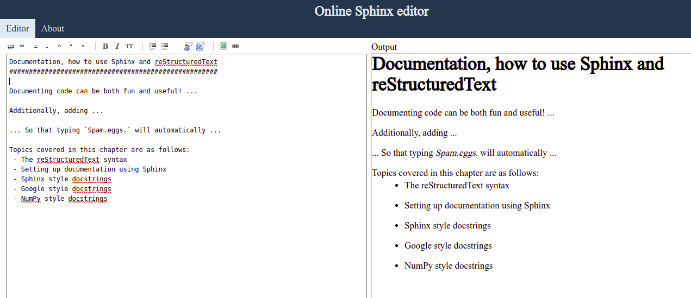
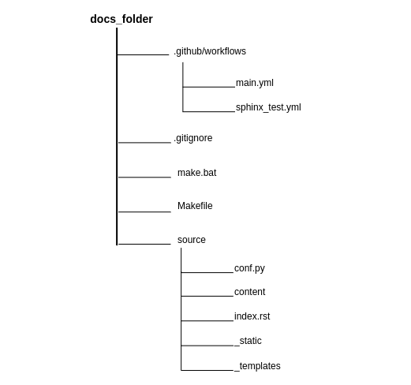
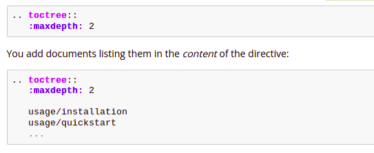
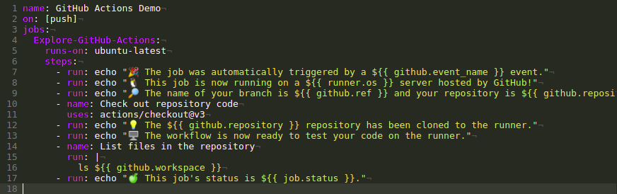

# The Sphinx documentation build process

The document explains how to set up a robust documentation system with
information about how Sphinx documentation works, using GitHub and
GitHub Actions, compilation and testing of Sphinx documentation on
GitHub, and automatic server update for the documentation system.

Topics covered in this document are:

-   A brief explanation of the documentation build process

-   Setting up documentation using Sphinx

-   Using GitHub and GitHub Actions

-   Updating documentation website automatically on Plesk server

## Pre-requisites

To implement this documentation build process, you must have:

-   Python 3.5+ installed

-   Knowledge about writing and building Sphinx documentation.

-   A GitHub account and a repository for the documentation source
    files.

-   A hosting platform like Plesk that has a GitHub client.

## Brief explanation of the Sphinx documentation build process

The documentation build process is a simple process which achieves its
aim of ensuring less human involvement in building, testing, maintaining
and updating the documentation website.

The tools used in the documentation build process are Python, Sphinx,
RST, GitHub and GitHub Actions, and Plesk.

The documentation build process is:

-   The technical writer writes documentation source files on his local
    machine using his favourite editor.

-   The technical writer sends the documentation source files to the
    **main** branch of a forked remote repository.

-   We test the updated source files on the forked repository before
    sending a pull request (PR) to the **main** branch on the official
    repository.

-   On the official repository, we test the PR changes and if
    successful, we merge the pull request changes into the **main**
    branch, else, we ask the one who sent the pull request to revisit
    the source files.

-   When we merge a PR change into the **main** branch of the official
    repository, we initiate a Sphinx build process to compile the source
    files, which generates HTML documents.

-   We move the HTML documents to the **docs-build** branch on the
    official repository.

-   Whenever the **docs-build** branch is updated, the GitHub client
    triggers an event to update the Plesk server with the latest
    contents from the **doc-build** branch.

-   We update the documentation website successfully.


*Fig. 1: Illustration of the Sphinx Documentation build process*

## Setting up documentation using Sphinx

### What is Sphinx?

Sphinx is a tool that makes it easy to create intelligent and beautiful
documentation in different output formats such as **HTML**, **LaTeX**
(for printable PDF versions), **EPUB**, Tex info, manual pages, and
plain text. Also, it has features like an easy definition of a document
tree, automatic highlighting of codes, automatic testing of code
snippets, and dozens of extensions contributed by the Sphinx community.

Sphinx uses **reStructuredText** as its markup language, and many of its
strengths come from the power and straightforwardness of
reStructuredText and its parsing and translating suite, the
**Docutils**.

### The reStructuredText syntax

The reStructuredText format (also known as RST, ReST, or reST) is a
simple language that implements enough markup to be usable and can be
easily read as plain text. These two features make it versatile enough
to generate pretty and useful documentation.

The greatest thing about reStructuredText is that even without knowing
anything about the standard, you can easily write documentation in this
style. However, more advanced techniques, such as images and links, do
require some explanation.

Within the Python community, reStructuredText has been the standard
documentation language for over 10 years, making it the recommended
solution. The figure below shows an example of the reStructuredText
syntax.



*Fig. 2: Illustration of a reStructuredText (left) and the output
(right)*

## Writing and building the documentation source using Sphinx on the local machine

To write and build the documentation website, you need to set up a
Python virtual environment and install Sphinx.

With Sphinx installed, you can run the `sphinx-quickstart` command to
set up a source directory and create a default **conf.py** file with the
most useful configuration values from a few questions it asks you.

The **conf.py** contains the Sphinx configuration file, where you can
configure all aspects of how Sphinx reads your sources and builds your
documentation.



*Fig. 3: Source directory for a Sphinx documentation*

Sphinx reads its contents from files with the extension ".rst". These
".rst" files contain the structure of the documentation and the text to
be displayed on the documentation website.

After you have set up the source directory for the documentation, the
next thing is to define the document structure.

Let's assume you have run the `sphinx-quickstart` command. It created a
source directory with **conf.py** and a root document, **index.rst**.
The main function of the root document is to serve as a welcome page and
to contain the root of the "table of contents tree" (or toctree). This
is one of the main things that Sphinx adds to reStructuredText, a way to
connect multiple files to a single hierarchy of documents.



*Fig. 4: The toctree reStructuredText directive*

After defining the document structure, you need to create ".rst files"
in the "content" directory and write your information in them using the
reStructuredText markup language. You can then link the created files in
the **index.rst** file. See
[reStructuredText](https://www.sphinx-doc.org/en/master/usage/restructuredtext/index.html)
for a more in-depth introduction to reStructuredText, including markup
added by Sphinx.

Now that you have added some files and content, let's make a first build
of the docs. A build is started with the `sphinx-build` command:

``` bash
    sphinx-build -b html sourcedir builddir
```

where **sourcedir** is the source directory, and **builddir** is the
directory in which you want to place the built documentation. The **-b**
option selects a builder; in this example, Sphinx will build HTML files.
You can then view the HTML files in your browser, then you can tweak the
source files to meet your needs.

## Using GitHub and GitHub Actions

After writing and building the documentation source on the local
machine, you need to transfer the source files to your remote repository
on GitHub.

You then need to test and build the documentation on the remote
repository. This is where GitHub Actions is used.

### What is GitHub Actions?

GitHub Actions is a
[CI/CD](https://en.wikipedia.org/wiki/CI/CD) platform that
allows you to automate your build, test, and deployment pipeline using
workflows. When using GitHub Actions, GitHub will provide you with
Linux, Windows, and macOS virtual machines to run your workflows.

You can configure a GitHub Actions workflow to be triggered when an
event, such as a push, occurs in your repository.

### Configuring a GitHub Actions Workflow

#### What is a workflow?

A workflow is a configurable and automated process that runs one or more
jobs. Each job runs inside its virtual machine runner, or a container,
and has one or more steps that either run a script you defined or run an
action from the GitHub Marketplace.

Workflows are defined by a YAML file checked in your repository and are
triggered either manually or by an event in the repository. Below is an
example of a GitHub Actions workflow.



For us to build and test the documentation, we will configure two (2)
GitHub Actions workflows and store them under the "*.github/workflows*"
directory. The two (2) GitHub Actions workflows are **sphinx_test.yml**
and **main.yml**.

The **sphinx_test.yml** workflow runs a CI test to ensure the
documentation builds, and this workflow is triggered by pull request
events on the **main** branch of the official repository.

The **main.yml** workflow, on the other hand, compiles the Sphinx
sources in the official repository's **main** branch and updates the
**docs-build** branch with the HTML files. This workflow is triggered by
push events on the **main** branch of the official repository.

#### Testing and Publishing Documentation Changes

On the Official repository, an update to the repository's **main**
branch must be tested first. We test by running the "Pull Request Docs
Check" (i.e., sphinx_test.yml) workflow either manually or by triggering
a pull request event.

If the test is successful, then the documentation project maintainer
will merge the pull request changes after reviewing the pull request.
This is to ensure that we review the changes in the pull request before
merging into the official repository.

When the documentation project maintainer merges the pull request
changes to the repository's **main** branch, GitHub triggers the
"Compile Sphinx source and update **docs-build** branch" (i.e.,
main.yml) workflow automatically.

If the build is successful, it sends the HTML files to the
**docs-build** branch.

## Updating documentation website automatically on Plesk server

The **docs-build** branch on the Official repository integrates with the
GitHub client for Plesk. On each push change made to the **docs-build**
branch, the Plesk GitHub client integration ensures that the Plesk
server is up-to-date with the files from the **docs-build** branch on
the Official repository.

We update the documentation website when we update the Plesk server.

## Conclusion

To conclude, Sphinx enables us to build well-structured and
well-designed documentation which is easy to maintain and update. And
with the help of GitHub and GitHub Actions, we can create a CI/CD
pipeline which enables us to automatically test and build our
documentation before publishing it to our users.
