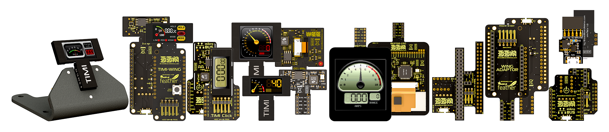

# Welcome to Breadboard Mates Resources

## Our Focus

At Breadboard Mates, we create novel and exciting products that inspire creativity in the project-maker community.

## What We Provide

An ever increasing range of hardware and continuously evolving software suite and tools to aid project development

## About Us

Breadboard Mates was established in October 2020 to bring breadboard-friendly products to the market, significantly reducing the time and components required to develop and experiment with electronics.

From hobbyist to engineering professional, Breadboard Mates cutting edge products can be utilised for seamless development with the help of the integrated products like [TIMI](https://breadboardmates.com/products/timi-96/) (Tiny Intelligent Modular Instrument) and the [Mates Studio](https://breadboardmates.com/products/mates-studio/) software development tool.

Mates Studio is unlike any other, offering four different programming methods with a library of hundreds of pre-designed pages and widgets. The result is an unprecedented increase in development speed for stand-alone, host driven or PC testing applications.

With investment backing from [4D Systems](https://4dsystems.com.au/), Breadboard Mates operates as an independent venture, with its own engineering delivery model and dedicated management and R&D team focused on bringing breadboard-friendly products to the market. The partnership is predicted to significantly scale up the efforts of the fast-growth Breadboard Mates team, with support and resourcing coming from a highly reputable partner.