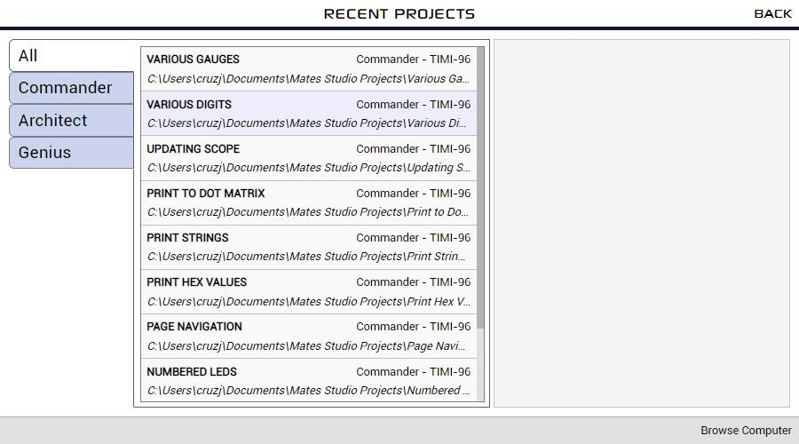
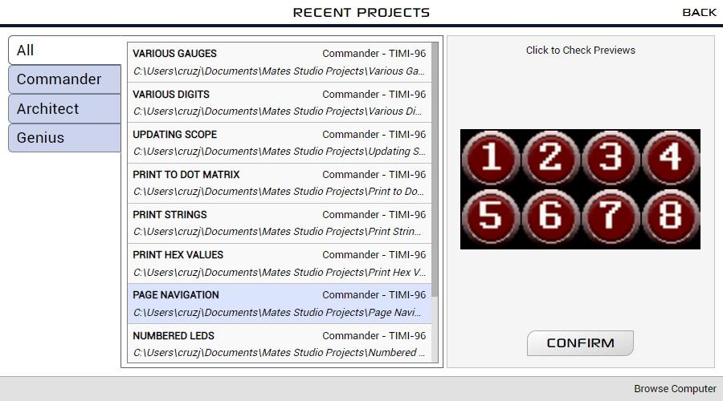

## Introduction

Mates Studio is an Integrated Development Environment design to be used with Breadboard Mates products. This software application is developed for Windows PCs.

The application includes multiple environments that users can utilize to design and develop simple and complex GUI applications for their prototyping needs.

### [Commander](commander.md)

This environment allows users to select and utilize different page designs/layouts from a built-in collection provided by the Breadboard Mates team and its community. This allows users to quickly produce nice looking GUI applications in seconds.

This output program features an easy-to-use-and-understand Mates Serial Command Protocol that can allows users to control the display using their favorite microcontrollers.

This also includes a simple to use interface that allows users to simulate a microcontroller controlling the display programmed with a Commander project.

### [Architect](architect.md)

This environment provides users with a lot more flexibility with their projects by providing the ability to design their custom page layouts using a collection of configurable graphical widgets. This allows users to create unique widget and page designs that can be saved for future use.

Saved widget configurations can be loaded and used in Architect, Genius and Builder projects. Saved page configurations can also be used in Commander environment.

Like the Commander environment, Architect utilizes the same command protocol and host controller simulator.

### [Genius](genius.md)

This environment provides users with the ability to not only design their own widget and page layouts but also to write their own program to directly control how the widgets in the display will behave. This also allows users to design custom features/functionality that they need which Commander and Architect environments is not able to provide.

Saved widget configurations can be loaded and used in Architect, Genius and Builder projects. Saved page configurations can also be used in Commander environment.

Unlike Commander and Architect environments, this environment does not include the Mates Serial Command protocol

### [Builder](builder.md)

_This environment is currently under development._

This environment will provide users with similar capabilities as the Genius environment. The main difference between Genius and Builder is simply the method of programming the display. While Genius allows user to write their own code, this environment allows users to design their project flow using graphical programming in the form of blocks.

## System Requirements

Mates Studio is currently available for 64-bit Windows PCs. Here are the requirements for installing the application:
- Windows 7 and later are supported, older operating systems are not supported (and do not work). Please note that the ARM version of Windows is not supported.
- An Intel Pentium 4 processor or later that’s SSE3 capable.
- At least 300 MB of storage space
- Minimum 1GB of RAM

## Installing the Application

Mates Studio can be installed for all users (system wide) or only for the current user.

By choosing to install for all users, the install will prompt for administrator privileges.

Once approved, the application will be installed in Program Files directory. The full path is typically:

    C:\Program Files\Mates Studio

If the application is installed only for the current user, the application will be in the current user’s AppData Local Programs directory. In that case, the full path is:

    C:\Users\%USERNAME%\AppData\Local\Programs\Mates Studio

The installer will provide a visual progress bar until the installation completes.

After successfully installing Mates Studio, the installer will prompt to optionally launch the application.

Tick `Run Mates Studio` to launch Mates Studio after installation if desired.

## Creating a New Project

### Selecting the Target Product Configuration

When the application opens, it will show the splash screen followed by the setup window.

Products can be filtered by choosing the category tabs on the left-hand side. The center column provides a filtered selection of products. By selecting a product from the list shown in the center column of the window, a preview of the product will be shown on the right-hand side.

By clicking on the preview, the project orientation can be set.

After selecting the product and desired orientation, continue by clicking on the `CONFIRM` button.

### Selecting the Target Environment

After confirming the product, the target environment needs to be selected to start a new project.

## Opening Projects

### Browsing Recent Projects

While in the setup window, recent projects can be browsed by clicking on the Browse Recent Projects button.

Recent projects can be filtered by choosing the category tabs on the left-hand side.

By selecting a project from the list shown in the middle column of the window, a preview of the project will be shown on the right-hand side.

By clicking on the preview, the other project pages can be browsed.

After confirming the project, it can be opened by clicking on the CONFIRM button.

### Browsing the Computer

While in the setup window, the computer can be browsed for projects by clicking on the Browse Computer button.

Mates Studio will open a file selection window which can be utilized to find and open a project anywhere in the computer.

