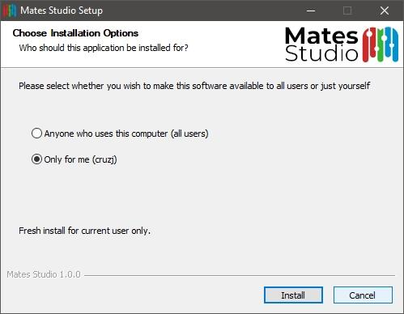
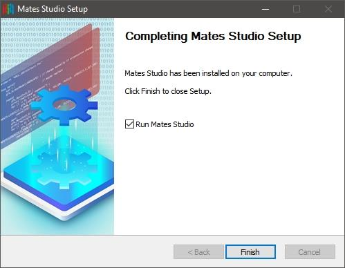
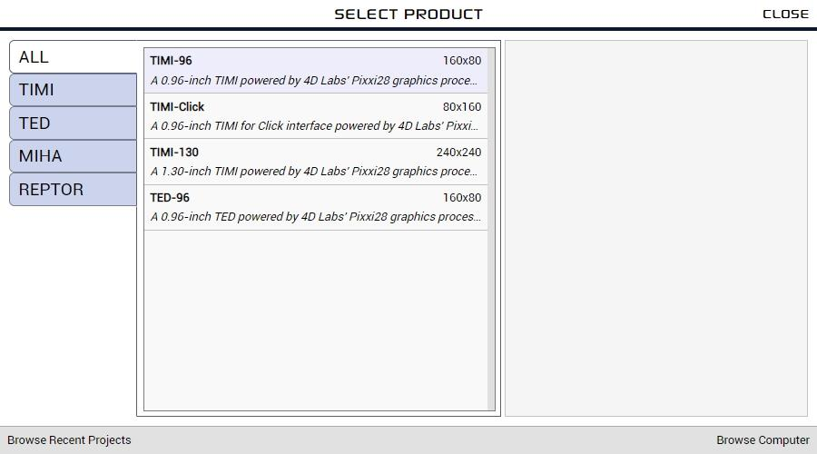
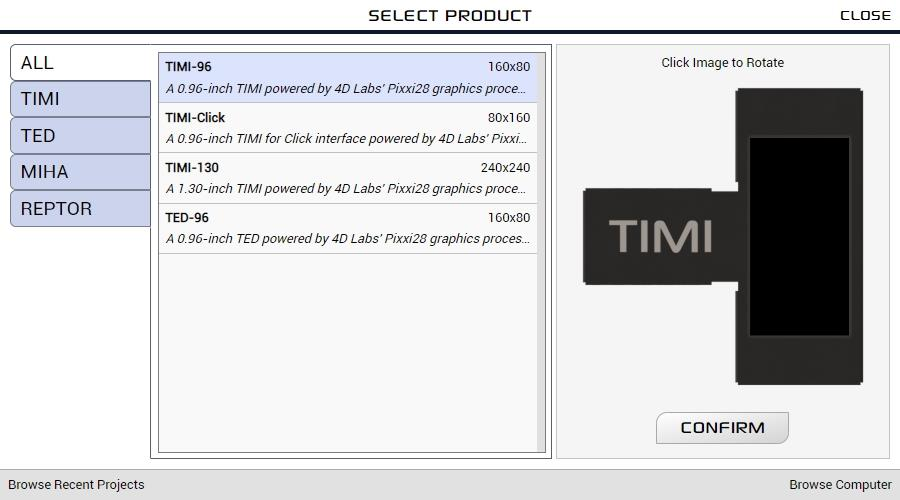
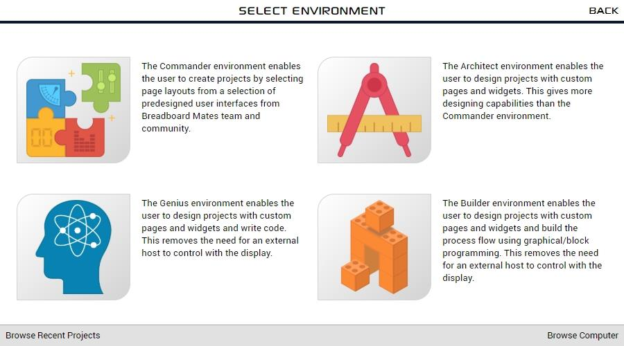
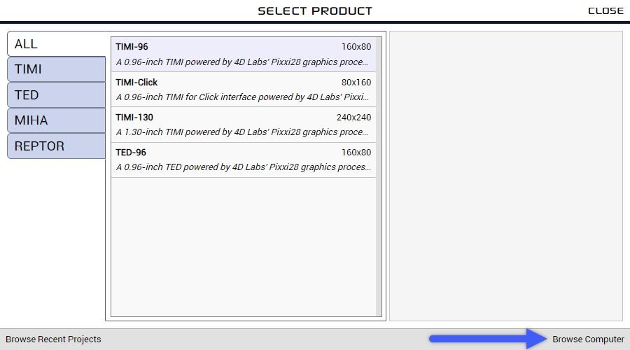
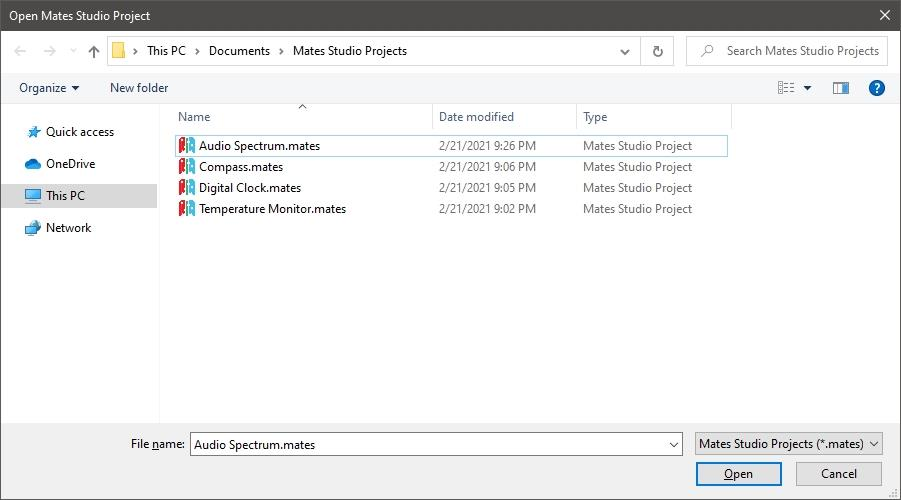

# Mates Studio User Manual

## Introduction

Mates Studio is an Integrated Development Environment designed to be used with Breadboard Mates products. This software application is developed for Windows PCs.

The application includes multiple environments that users can utilize to design and develop simple and complex GUI applications for their prototyping needs.

#### [Commander](mates-studio-commander-environment.md)

Commander is the simplest among all Mates Studio environments. It allows users to select and utilize different page designs/layouts from a built-in collection provided by the Breadboard Mates team and its community. This allows development of GUI applications in seconds.

This environment is designed to program Breadboard Mates modules to be used with a host controller using the [Mates Controller Command Protocol](mates-controller-command-protocol.md). This allows users to control the display using their favorite microcontrollers through Serial UART.

This environment also includes a [Mates Controller Interface](mates-controller-interface.md) that simulates a microcontroller controlling the display module programmed with a Commander project.

#### [Architect](mates-studio-architect-environment.md)

Similar to Commander, the Architect environment was designed to program modules to be used with a host controller and features [Mates Controller Command Protocol](mates-controller-command-protocol.md). It also provides the [Mates Controller Interface](mates-controller-interface.md) to simulate a host controller.

The main advantage of Architect over Commander is the increased flexibility with designing their projects by featuring a [Graphics Editor](mates-studio-graphics-editor.md) which allows custom widget and page designs.

#### [Genius](mates-studio-genius-environment.md)

The Genius environment is designed to allow user to write their own custom programs for Breadboard Mates module. This allows Breadboard Mates modules to work as standalone devices.

It features a [Graphics Editor](mates-studio-graphics-editor.md)  allowing custom widget and page designs and a [Code Editor](mates-studio-code-editor.md) to write the program in [4D Graphics Language (4DGL)](https://4dsystems.com.au/mwdownloads/download/link/id/17/). This provides direct control of the widgets and the unused device peripherals allowing custom functionalities that users need which Commander and Architect are not able to provide.

#### [Builder](mates-studio-builder-environment.md)

Similar to Genius, the Builder environment is designed to allow user to develop custom programs for their Breadboard Mates modules.

It also features a [Graphics Editor](mates-studio-graphics-editor.md)  allowing custom widget and page designs. But instead of a code editor, it features a [Blocks Editor](mates-studio-blocks-editor.md). This also provides direct control of the widgets and the unused device peripherals allowing custom functionalities that users need which Commander and Architect are not able to provide.

This environment is designed mainly for inexperienced 4DGL developers but can also be used by seasoned developers. This environment can be used to develop varying complexity of projects. However, as the project becomes increasingly complicated, writing the code in Genius can prove to be more managable for experience developers.

## System Requirements

Mates Studio is currently available for 64-bit Windows PCs. Here are the requirements for installing the application:

- Windows 7 and later are supported, older operating systems are not supported (and do not work). Please note that the ARM version of Windows is not supported.
- An Intel Pentium 4 processor or later that’s SSE3 capable.
- At least 300 MB of storage space
- Minimum 1GB of RAM (_depends on usage_)

## Installation

Mates Studio can be installed for all users (system wide) or only for the current user.

By choosing to install for all users, the install will prompt for administrator privileges.

Once approved, the application will be installed in Program Files directory. The full path is typically:

    C:\Program Files\Mates Studio

If the application is installed only for the current user, the application will be in the current user’s AppData Local Programs directory. In that case, the full path is:

    C:\Users\%USERNAME%\AppData\Local\Programs\Mates Studio

The installer will provide a visual progress bar until the installation completes.

After successfully installing Mates Studio, the installer will prompt to optionally launch the application.

Tick `Run Mates Studio` to launch Mates Studio after installation if desired.

## Creating a New Project

### Selecting Product and Orientation

When the application opens, it will show the splash screen followed by the setup window.

Products can be filtered by choosing the category tabs on the left-hand side. The center column provides a filtered selection of products. By selecting a product from the list shown in the center column of the window, a preview of the product will be shown on the right-hand side.

By clicking on the preview, the project orientation can be set.

After selecting the product and desired orientation, continue by clicking on the `CONFIRM` button.

### Selecting Environment

After confirming the product, the target environment needs to be selected to start a new project.

## Opening Projects

### Browsing Recent Projects

While in the setup window, recent projects can be browsed by clicking on the Browse Recent Projects button.

Recent projects can be filtered by choosing the category tabs on the left-hand side.

By selecting a project from the list shown in the middle column of the window, a preview of the project will be shown on the right-hand side.

By clicking on the preview, the other project pages can be browsed.

After confirming the project, it can be opened by clicking on the CONFIRM button.

### Browsing the Computer

While in the setup window, the computer can be browsed for projects by clicking on the Browse Computer button.

Mates Studio will open a file selection window which can be utilized to find and open a project anywhere in the computer.

