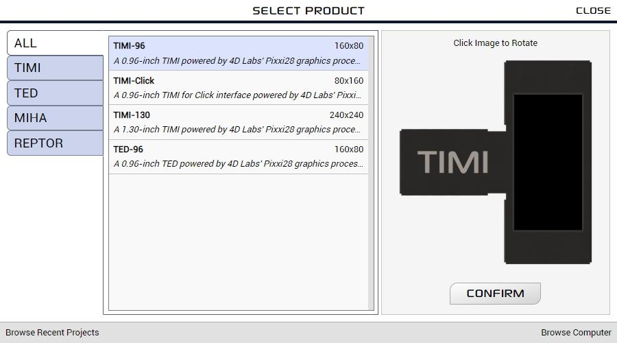
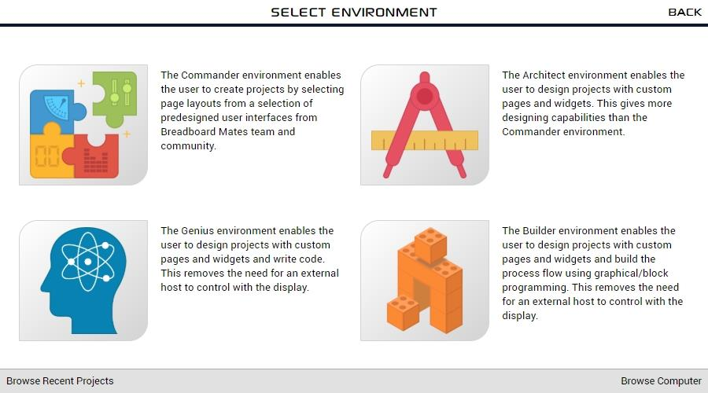

---
tags:
  - Commander
---

# Getting Started with Commander

## Introduction

Commander is a versatile environment which enables developers to create a full projects on BBM display modules that can be controlled by simple serial commands. Project can be quickly created from a selection of predesigned pages or custom pages designed using the other three Mates Studio environments.

After adding pages to the project and uploading to the BBM module, each page can be tested fully by using a built-in host simulator. This [simulator](../../Mates Studio/mates-controller-interface.md) provides a simple user interface to navigate across pages and control the widgets to give a visualization of what the host controller can do with the project. All this can be achieved without entering a single piece of code for the BBM module and in many cases, with the vast library of predesigned pages, no need for any design work to quickly bring projects to life ready to accept simple serial commands from the chosen host microcontroller.

## Project Development

Start a new Commander project for the target module. For this tutorial, TIMI-96 in it's default orientation will be used.

{: class="custom-img-shadow" }

{: class="custom-img-shadow" }

### Adding Pages

### Testing the Project

### Deploying the Project

